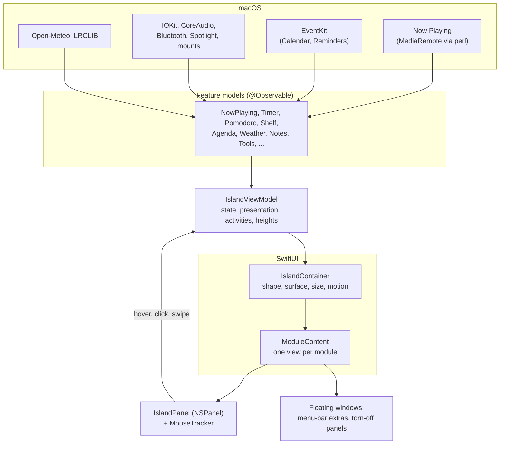

# MacIsland

A Dynamic Island for the MacBook notch. It is part of the hardware: it grows out of the notch to show what is live
(music, a timer, a download), then folds back in. Click it and it opens into a small dashboard of everyday tools.

It is a native macOS app written in Swift and SwiftUI, built as a Swift package with only the Command Line Tools (no Xcode
project). One borderless `NSPanel` hosts the whole island.


> The pictures in these docs are renders of the real SwiftUI views (`./scripts/docs-images.sh`). They show layout, type, and
> color, but not Liquid Glass, text fields, or scrolling lists, and the sound bars are held still. See
> [Regenerating the pictures](docs/SCRIPTS.md#docs-imagessh).

## Contents

| Read this | For |
| --- | --- |
| **This file** | What it is, how to run it, a tour, how it works in brief |
| [docs/FEATURES.md](docs/FEATURES.md) | Every feature, module by module, with pictures and exact behavior |
| [docs/ARCHITECTURE.md](docs/ARCHITECTURE.md) | How it works: layers, state, windows, input, data, permissions, gotchas |
| [docs/SCRIPTS.md](docs/SCRIPTS.md) | Every script and config file, and a map of every source file |
| [docs/ROADMAP.md](docs/ROADMAP.md) | What is built, what is next, what has not been tried by hand, and what was ruled out |
| [DESIGN.md](DESIGN.md) | The design system: surfaces, presentations, color, type, motion, metrics |
| [CLAUDE.md](CLAUDE.md) | Instructions for Claude Code sessions in this repo |

## Quick start

Runs on **macOS 15 Sequoia or later, on Apple Silicon**. On macOS 26 the surfaces are Liquid Glass; on 15 they are the
same shapes in material. It is built from source (there is no download), with the Command Line Tools only: Xcode is not
needed. The steps are the same on every macOS version from 15 up.

**1. Check your Mac.**

```sh
sw_vers -productVersion    # 15.0 or later
uname -m                   # arm64
```

**2. Install the Command Line Tools 26 or later** (Swift 6.2+ and the macOS 26 SDK), then check them.

```sh
xcode-select --install     # or: System Settings > General > Software Update > Command Line Tools for Xcode 26
swift --version            # must say Swift version 6.2 or later
```

If `swift --version` still says something older, an old Xcode is selected (or one was deleted): run
`sudo xcode-select -s /Library/Developer/CommandLineTools`, then check again. Still older? See [Troubleshooting](#troubleshooting).

**3. Get the code.** `git` comes with the Command Line Tools.

```sh
git clone https://github.com/ethantiller/macisland2.git
cd macisland2
```

**4. Build and start it.**

```sh
make build-and-restart
```

The first build takes a few minutes. It also makes a signing identity, "MacIsland Dev", in your login keychain, so macOS
keeps the permissions you grant across rebuilds; macOS may ask for your login password, and if you say no, the build signs
ad hoc and still works (permissions are then asked again after each rebuild).

**5. Finish the guide.** There is no Dock icon. Look for the capsule icon in the menu bar, and for the island at the
notch (a Mac without a notch gets a pill at the top of the screen). A short guide asks for each permission in turn, and
the island stays hidden until it is finished and everything is allowed.

**Updating:** `git pull && make build-and-restart`.

For developers:

```sh
./scripts/test.sh                                                           # the tests, under a few seconds
ISLAND_SNAPSHOT_DIR=/tmp/island ./scripts/test.sh --filter IslandSnapshots  # render every state to PNG
make doctor                                                                 # print the Mac, toolchain and build, for bug reports
```

UI changes only show after `make build-and-restart`. All scripts: [docs/SCRIPTS.md](docs/SCRIPTS.md). `make first-run`
is a dev-only reset to a true first launch (it wipes permissions); skip it when installing.

## Troubleshooting

First, run **`make doctor`**. It prints the macOS version, the selected toolchain, the checkout, and the built app, and
changes nothing; paste it when asking for help.

| What you see | What it means | Fix |
| --- | --- | --- |
| `Package.swift:6:25: error: reference to member 'v26' cannot be resolved without a contextual type`, or `SwiftSetting has no member 'swiftLanguageMode'` | The selected Swift is older than 6.0 (usually an old Xcode picked by `xcode-select`). It is not your macOS version. | Step 2: `xcode-select --install`, then `sudo xcode-select -s /Library/Developer/CommandLineTools`, then `swift --version` must say 6.2 or later |
| `The selected toolchain is too old` | `scripts/check-toolchain.sh` found Swift below 6.2 or an SDK below 26 | The same fix; the message prints what is selected |
| `swift: command not found`, `xcode-select: error: invalid developer directory`, or `make: command not found` | No toolchain is selected, or the Xcode that was is gone | `xcode-select --install`, then `sudo xcode-select -s /Library/Developer/CommandLineTools` |
| `xcode-select --install` says the software can't be installed, or Software Update shows no Command Line Tools 26 | Your macOS is too old for the newest tools, or an organization policy hides updates | Update macOS in Software Update first; on a managed Mac, ask IT for Command Line Tools 26 |
| `is only available in macOS 26.0 or newer` while building | A new macOS 26 API was used without a macOS 15 fallback (a bug in the code, not your setup) | Report it with `make doctor`; the fix is an `if #available(macOS 26, *)` ([ARCHITECTURE.md](docs/ARCHITECTURE.md#gotchas-and-lessons)) |
| Build errors that make no sense after switching toolchains or pulling | A stale build | `rm -rf .build build && make build-and-restart` |
| A password prompt for the keychain, or `Couldn't make it; signing ad hoc` | The signing identity could not be made | Harmless. Allow it and rebuild to keep permissions; or `MACISLAND_ADHOC=1 make bundle` to skip it |
| Nothing appears | The island stays hidden until the guide is finished and every permission is allowed | Click the capsule icon in the menu bar, then Settings > General > Guide. `pgrep -x MacIsland` says whether it is running |
| `"MacIsland" can't be opened` | macOS quarantined a copy of the app that was downloaded or sent to you | Build it yourself (step 4), or `xattr -dr com.apple.quarantine build/MacIsland.app` |
| A permission shows on in System Settings but the app says it's off | The permission belongs to an older build of the app | `tccutil reset All com.ethantiller.MacIsland`, open the app, and allow it again |
| Nothing shows in Now Playing | Music and Spotify need the Automation permission, and the track is read through `/usr/bin/perl` | Grant Automation in the guide (Settings > Privacy > Grant); play something |
| A voice note says speech recognition isn't available for the language | Notes are turned into text on this Mac only, and no on-device model exists for your language | Nothing is sent to Apple, so the note can't be made; pick a supported language |

### Digging deeper

```sh
# The full build output, to send along
make bundle 2>&1 | tee /tmp/macisland-build.log

# What the app logs while it runs (leave this open, then reproduce the problem)
log stream --predicate 'subsystem == "com.ethantiller.MacIsland"' --level debug

# Run it in the foreground, so its NSLog output shows in this terminal
pkill -x MacIsland; build/MacIsland.app/Contents/MacOS/MacIsland

# A crash leaves a report here; send the newest MacIsland one
open ~/Library/Logs/DiagnosticReports
```

## How you use it

| Do this | Get this |
| --- | --- |
| Something is live | The **compact** island: one activity split around the notch, or two as a pair |
| Rest the pointer on it | A brief swell, then the **peek** (after 120 ms by default; Settings → General → Input): the top activity at full size |
| Click, swipe two fingers down, or press **⌃⌥Space** | The **expanded** island: a tab strip and the selected module |
| Press **⌃⌥S** | The expanded island on the **Shelf** |
| ← / → , or a two-finger horizontal swipe | Previous or next tab |
| Esc, or move the pointer away for 300 ms | Step back one level (a picked day, the Tools grid, the Mixer, a search), then fold back in |
| Drag a file onto it | Drop targets: keep it on the Shelf, or AirDrop it |
| First launch | A short **guide** shows the gestures and modules with the real island, and asks for each permission in turn, one step at a time. Every permission is required: the island stays hidden until the guide is finished and all are allowed. Replay it, or the Settings tour, from Settings → General → Guide |

## A tour

### Compact: what is live, beside the notch

| | |
| --- | --- |
|  | Music: artwork and sound bars (the bars bounce in the app) |
|  | Two activities at once, as a minimal pair: the higher rank leads |
|  | An alert: a glyph and a number, colored by what it means |

### Banners: an event worth noticing once

| | |
| --- | --- |
|  | A device connecting, in a ring that turns red when it is low |
|  | A problem, centered, with nothing to press |
|  | A notification macOS showed, with Open and Dismiss (Notifications on, In the Island) |

### Peeks: hover for the top activity

| | |
| --- | --- |
|  | Music, in the Dynamic Island's own layout |
|  | Nothing live: the day, the weather, the everyday tools |
|  | A timer, with when it ends and quick extensions |

### Expanded: seven modules

Up to **five tabs left of the notch and one right of it**, arranged in Settings.

| Home | Media |
| --- | --- |
|  |  |
| **Clock** | **Tools** |
|  |  |
| **Reminders** | **Notes** |
|  |  |

Also **Shelf** (files and clipboard). Everything is in [docs/FEATURES.md](docs/FEATURES.md).

## How it works, in brief



- **One panel, always there.** A borderless `NSPanel` is pinned to the top center of the screen. The island's base view is
  560 x 276; its 976 pt click-through host leaves room for the Media output satellites. It ignores the mouse except over
  the visible island and those controls, so it never blocks anything else.
- **State lives in `IslandViewModel`.** It holds the presentation (compact, banner, peek, expanded), which tab is
  selected, the alert and banner, and works out the ranked list of live activities and the size of everything. Views are
  thin and read from it.
- **Features are separate models.** Each is a small `@Observable` class (a timer, the weather, the Shelf) that
  the view model reads. They are bundled in one `IslandFeatures` struct, which tests replace with doubles.
- **One design system.** Colors, type, metrics, and motion all come from `Theme.swift`. Color means one thing each
  (music, time, in progress, done, needs you); everything else is black and white. See [DESIGN.md](DESIGN.md).
- **The same views draw on the island and on glass.** `Theme.Palette` follows the surface it is on, so modules render
  in the menu bar, in torn-off windows, and on the island from one `ModuleContent` view.

The full story, with state machines, data flow, and the lessons learned, is in
[docs/ARCHITECTURE.md](docs/ARCHITECTURE.md).

## Privacy and permissions

When AI Agents is on, it reads the Claude Code and Codex logs in your home folder, and the Claude app's usage file (`~/Library/Application Support/Claude/plan-usage-history.json`) for plan limits; a summary of the last 91 days is cached in `~/Library/Caches/com.ethantiller.MacIsland/Agents` and deleted when the feature is turned off. Nothing is sent.

When Notifications is on, it reads the text of the banners macOS shows (the app, title, and body) through Accessibility, keeps the newest fifty in memory only, and empties them when the screen locks or the feature is turned off. They are never written to disk or sent anywhere.

Nothing leaves the Mac except: the **city name** you type in Settings (to Open-Meteo, for weather), and the **track's
name, artist, album, and length** (to lrclib.net, for synced lyrics; can be turned off). Clipboard history stays in memory.
Web searches open in your browser. **Widgets you make** can also send one HTTPS request to the address you type (a web
widget), or run a Shortcut or a program you chose (a command widget); both run only while Home is showing, and Settings → Privacy
lists every host and everything MacIsland runs.

**Nothing asks at launch.** The first-run guide walks through Calendars, Reminders, Bluetooth, Downloads, Camera, Microphone (with Speech), Screen Recording, Accessibility, Focus, and Automation, one step each with a reason and **Grant Permission** (each required, so the island appears only once all ten are allowed); Settings → Privacy has a **Grant** for anything not yet asked; and otherwise macOS asks when a feature first needs it (and for a folder widget in Desktop or Documents). The app is signed
ad hoc, so **every rebuild resets these**: reset them with `tccutil reset All com.ethantiller.MacIsland`.
**Optional access:** a feature that starts off and needs a permission (the Mixer's System Audio Recording) asks only when you turn it on and press Allow; it is never part of the guide, and a preset never asks. Details and the full list: [docs/ARCHITECTURE.md](docs/ARCHITECTURE.md#permissions-network-and-external-commands).

## Status

The island, its seven modules, Home widgets, a Settings window of six panes with a live preview and a Features catalog (switch off what you don't use), menu-bar and torn-off windows, and a first-run guide and Settings tour are built. The
everyday features (file tools and converters, clipboard, Outlook and Teams, ambient banners, capture) are built too: see
[docs/ROADMAP.md](docs/ROADMAP.md#next). What is done, the decisions along the way, what still needs a hand test, and what was
ruled out are in [docs/ROADMAP.md](docs/ROADMAP.md).

## Third-party code

`Vendor/mediaremote-adapter` is [ungive/mediaremote-adapter](https://github.com/ungive/mediaremote-adapter) at commit
`73f14ab`, BSD-3-Clause (see its `LICENSE` and `VENDORED.txt`). It gives Now Playing access on macOS 15.4 and later,
where Apple restricts MediaRemote to its own binaries, by running inside `/usr/bin/perl`.
