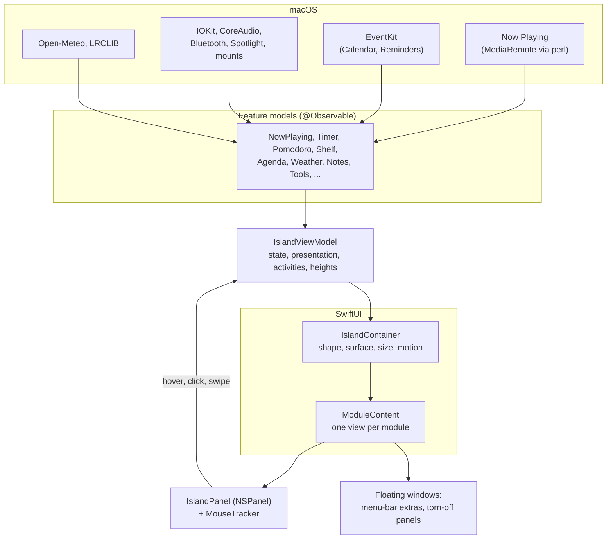

# MacIsland

A Dynamic Island for the MacBook notch. It is part of the hardware: it grows out of the notch to show what is live
(music, a timer, a download), then folds back in. Click it and it opens into a small dashboard of everyday tools.

It is a native macOS app written in Swift and SwiftUI, built as a Swift package with only the Command Line Tools (no Xcode
project). One borderless `NSPanel` hosts the whole island.


> The pictures in these docs are renders of the real SwiftUI views (`./scripts/docs-images.sh`). They show layout, type, and
> color, but not Liquid Glass, text fields, or scrolling lists, and the sound bars are held still. See
> [Regenerating the pictures](docs/SCRIPTS.md#docs-imagessh).

## Contents

| Read this | For |
| --- | --- |
| **This file** | What it is, how to run it, a tour, how it works in brief |
| [docs/FEATURES.md](docs/FEATURES.md) | Every feature, module by module, with pictures and exact behavior |
| [docs/ARCHITECTURE.md](docs/ARCHITECTURE.md) | How it works: layers, state, windows, input, data, permissions, gotchas |
| [docs/SCRIPTS.md](docs/SCRIPTS.md) | Every script and config file, and a map of every source file |
| [docs/ROADMAP.md](docs/ROADMAP.md) | What is built, what is next, what has not been tried by hand, and what was ruled out |
| [DESIGN.md](DESIGN.md) | The design system: surfaces, presentations, color, type, motion, metrics |
| [CLAUDE.md](CLAUDE.md) | Instructions for Claude Code sessions in this repo |

## Quick start

Requires macOS 26 and Swift 6.3 (the Command Line Tools are enough).

```sh
./scripts/bundle.sh && pkill -x MacIsland; open build/MacIsland.app   # build, (re)start (the first build makes a signing identity)
./scripts/test.sh                                                     # 946 tests, under a second
ISLAND_SNAPSHOT_DIR=/tmp/island ./scripts/test.sh --filter IslandSnapshots   # render every state to PNG
```

UI changes only show after the bundle step. The app has no Dock icon; look for the notch, and the capsule icon in the
menu bar (Settings, Quit). All scripts: [docs/SCRIPTS.md](docs/SCRIPTS.md).

## How you use it

| Do this | Get this |
| --- | --- |
| Something is live | The **compact** island: one activity split around the notch, or two as a pair |
| Rest the pointer on it | A brief swell, then the **peek** (after 120 ms): the top activity at full size |
| Click, swipe two fingers down, or press **⌃⌥Space** | The **expanded** island: a tab strip and the selected module |
| Press **⌃⌥S** | The expanded island on the **Shelf** |
| ← / → , or a two-finger horizontal swipe | Previous or next tab |
| Esc, or move the pointer away for 300 ms | Fold back in |
| Drag a file onto it | Drop targets: keep it on the Shelf, or AirDrop it |
| First launch | A short **guide** shows the gestures and modules with the real island, and asks for each permission in turn, one step at a time. Every permission is required: the island stays hidden until the guide is finished and all are allowed. Replay it, or the Settings tour, from Settings → General → Guide |

## A tour

### Compact: what is live, beside the notch

| | |
| --- | --- |
|  | Music: artwork and sound bars (the bars bounce in the app) |
|  | Two activities at once, as a minimal pair: the higher rank leads |
|  | An alert: a glyph and a number, colored by what it means |

### Banners: an event worth noticing once

| | |
| --- | --- |
|  | A device connecting, in a ring that turns red when it is low |
|  | A problem, centered, with nothing to press |

### Peeks: hover for the top activity

| | |
| --- | --- |
|  | Music, in the Dynamic Island's own layout |
|  | Nothing live: the day, the weather, the everyday tools |
|  | A timer, with when it ends and quick extensions |

### Expanded: seven modules

Up to **five tabs left of the notch and one right of it**, arranged in Settings.

| Home | Media |
| --- | --- |
|  |  |
| **Clock** | **Tools** |
|  |  |
| **Reminders** | **Notes** |
|  |  |

Also **Shelf** (files and clipboard). Everything is in [docs/FEATURES.md](docs/FEATURES.md).

## How it works, in brief



- **One panel, always there.** A borderless `NSPanel` is pinned to the top center of the screen, always as big as the
  largest the island gets (560 x 276). It ignores the mouse except over the visible island, so it never blocks anything.
- **State lives in `IslandViewModel`.** It holds the presentation (compact, banner, peek, expanded), which tab is
  selected, the alert and banner, and works out the ranked list of live activities and the size of everything. Views are
  thin and read from it.
- **Features are separate models.** Each is a small `@Observable` class (a timer, the weather, the Shelf) that
  the view model reads. They are bundled in one `IslandFeatures` struct, which tests replace with doubles.
- **One design system.** Colors, type, metrics, and motion all come from `Theme.swift`. Color means one thing each
  (music, time, in progress, done, needs you); everything else is black and white. See [DESIGN.md](DESIGN.md).
- **The same views draw on the island and on glass.** `Theme.Palette` follows the surface it is on, so modules render
  in the menu bar, in torn-off windows, and on the island from one `ModuleContent` view.

The full story, with state machines, data flow, and the lessons learned, is in
[docs/ARCHITECTURE.md](docs/ARCHITECTURE.md).

## Privacy and permissions

When AI Agents is on, it reads the Claude Code and Codex logs in your home folder, and the Claude app's usage file (`~/Library/Application Support/Claude/plan-usage-history.json`) for plan limits; a summary of the last 91 days is cached in `~/Library/Caches/com.ethantiller.MacIsland/Agents` and deleted when the feature is turned off. Nothing is sent.

Nothing leaves the Mac except: the **city name** you type in Settings (to Open-Meteo, for weather), and the **track's
name, artist, album, and length** (to lrclib.net, for synced lyrics; can be turned off). Clipboard history stays in memory.
Web searches open in your browser. **Widgets you make** can also send one HTTPS request to the address you type (a web
widget), or run a Shortcut or a program you chose (a command widget); both run only while Home is showing, and Settings → Privacy
lists every host and everything MacIsland runs.

**Nothing asks at launch.** The first-run guide walks through Calendars, Reminders, Bluetooth, Downloads, Camera, Microphone (with Speech), Screen Recording, Accessibility, Focus, and Automation, one step each with a reason and **Grant Permission** (each required, so the island appears only once all ten are allowed); Settings → Privacy has a **Grant** for anything not yet asked; and otherwise macOS asks when a feature first needs it (and for a folder widget in Desktop or Documents). The app is signed
ad hoc, so **every rebuild resets these**: reset them with `tccutil reset All com.ethantiller.MacIsland`.
**Optional access:** a feature that starts off and needs a permission (the Mixer's System Audio Recording) asks only when you turn it on and press Allow; it is never part of the guide, and a preset never asks. Details and the full list: [docs/ARCHITECTURE.md](docs/ARCHITECTURE.md#permissions-network-and-external-commands).

## Status

The island, its seven modules, Home widgets, a Settings window of six panes with a live preview and a Features catalog (switch off what you don't use), menu-bar and torn-off windows, and a first-run guide and Settings tour are built. The
everyday features (file tools and converters, clipboard, Outlook and Teams, ambient banners, capture) are built too: see
[docs/ROADMAP.md](docs/ROADMAP.md#next). What is done, the decisions along the way, what still needs a hand test, and what was
ruled out are in [docs/ROADMAP.md](docs/ROADMAP.md).

## Third-party code

`Vendor/mediaremote-adapter` is [ungive/mediaremote-adapter](https://github.com/ungive/mediaremote-adapter) at commit
`73f14ab`, BSD-3-Clause (see its `LICENSE` and `VENDORED.txt`). It gives Now Playing access on macOS 15.4 and later,
where Apple restricts MediaRemote to its own binaries, by running inside `/usr/bin/perl`.
