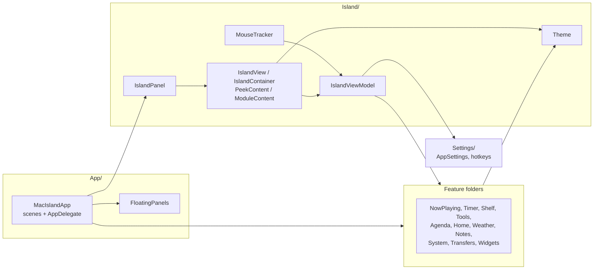
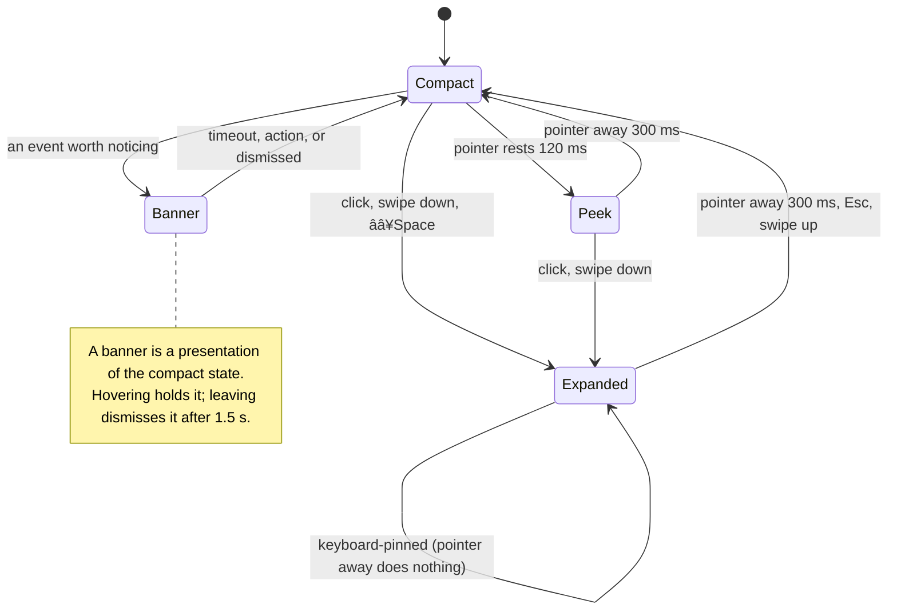
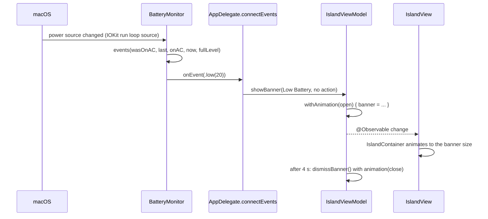

# Architecture

How MacIsland works. Back to the [README](../README.md). What it does: [FEATURES.md](FEATURES.md). Every file:
[SCRIPTS.md](SCRIPTS.md#source-map). The design rules: [../DESIGN.md](../DESIGN.md).

**Contents:** [The shape of the app](#the-shape-of-the-app) · [Startup](#startup) · [The panel and input](#the-panel-and-input) ·
[State: the view model](#state-the-view-model) · [Presentations](#presentations) · [Activities](#activities-what-is-live) ·
[Drawing](#drawing-container-surfaces-motion) · [Modules](#modules-and-the-tab-strip) · [Floating surfaces](#floating-surfaces) ·
[Data and events](#data-and-events) · [Storage](#storage) ·
[Permissions, network, and external commands](#permissions-network-and-external-commands) · [Testing](#testing) ·
[Gotchas and lessons](#gotchas-and-lessons)

---

## The shape of the app

A Swift package with one executable target (`MacIsland`) and one test target. Swift 6.3 toolchain, tools version 6.2, macOS 26,
compiled in **Swift 5 language mode** (`swiftLanguageMode(.v5)`), so strict concurrency is relaxed. There is no Xcode project:
`scripts/bundle.sh` wraps the built binary into `build/MacIsland.app`.

Layers, from the bottom:

1. **Feature models** are small `@MainActor @Observable` classes. Each owns one capability and has no UI knowledge.
2. **`IslandFeatures`** is a struct that holds one of each. It is the single thing tests replace with doubles.
3. **`IslandViewModel`** reads the features and owns the island's own state: presentation, selected tab, the current alert
   and banner, hover logic, sizes.
4. **Views** are thin. They read the view model and features, and call methods on them.
5. **`Theme`** is the only source of colors, type, metrics, and motion.

---

## Startup

`MacIslandApp` is a SwiftUI `App` with an `NSApplicationDelegateAdaptor`. It declares the capsule and the module menu bars as scenes (the Settings window is an `NSWindow` made by `SettingsWindowController`, not a scene). It was once three scenes:

| Scene | What |
| --- | --- |
| `MenuBarExtra("MacIsland")` | The always-present capsule icon: Settings, Quit |
| `Settings` | The Settings window |
| `ModuleMenuBars` | One optional `MenuBarExtra` per module, inserted only when chosen in Settings |

`AppDelegate` owns `OnboardingState` as its **first stored property**, so it tells an existing install from a fresh one before anything
in the launch can write a setting (see [First run](#first-run)). It builds everything in `applicationDidFinishLaunching`:

1. Sets the activation policy to `.accessory` (no Dock icon). Installs a SIGTERM handler so `pkill` quits cleanly and stops
   the adapter subprocess.
2. `connectEvents()` wires the monitors to the view model: timer and Pomodoro finish, battery, headphones, hotspot,
   downloads, unlock, agenda, drives and screenshots, file tools, lyrics, weather. Then starts the monitors.
3. Creates the `IslandPanel` hosting `IslandView`, sizes it for the screen, and shows it.
4. Creates the `MouseTracker`, and wires keyboard handling (Esc and arrows in the panel; the global hotkeys).
5. `connectReach()` wires torn-off windows (`onOpenWindow`) and opening Settings.
6. Observes screen changes to re-lay-out.
7. `connectOnboarding()` gives the guide's window what it needs, wires the `guide` and `tour` links, and shows the guide if this
   install hasn't seen it. On a fresh install whose guide is pending, `connectEvents()` held back the headphones and Downloads
   monitors (they can show a system prompt at launch); they start when the guide ends, and the headphones monitor also when
   Bluetooth is allowed in it. Both `start()`s are safe to call twice.

`AppDelegate.makeFeatures()` is the one place that builds the real `IslandFeatures`. `TestSupport.makeViewModel()` is its twin
for tests, and `PreviewFeatures.make(live:scratch:)` is its twin for the Settings preview: **a new feature touches all three**.

### Shelf, clipboard, and screenshot choices

`ShelfModel` keeps when each file was added (`shelf.added`, by path; files from before it count from the first launch after) and
`sweep(_:)` drops references older than the retention, run on launch and when the Shelf appears, never on a timer. The clipboard
limit is `ClipboardHistory.setCapacity` (0, 10, 25, 50): 0 stops the 0.7 s poll and clears the history, the one standing timer the app
had. Add New Screenshots off stops the Spotlight query (`ScreenshotWatcher.stop`), which is also what makes the first minute after
launch busier. `AppSettings.dragTarget` gates `setFileDragActive`, the drop delegate, and the drop tiles. Show Music Beside the Notch
off makes `compactActivities` skip `.media`. The Shelf's last mode is stored (`shelfMode`); a drop always shows Files.

### The settings archive

`SettingsArchive` (`{format: "MacIsland Settings", version: 1, ...}`, every field optional) holds every choice on the panes and Home
(through a `HomeArchive`). `AppSettings.restore(_:)` checks each value (an invalid one is skipped, a layout is fitted, tabs and
engines are repaired), gives imported custom widgets new ids, and keeps the command widgets made on this Mac. **A command widget is
never written and never accepted**, even from a hand-edited file. Launch at Login is the system's, so it is not in the file.
`resetAll()` restores a fresh install's values by reading them from a scratch `AppSettings`.

### Ambient events

`AmbientEvent` names the twelve interruptions that arrive on their own. `flash` and `showBanner` take `event:` and drop the call when
it is muted (a banner's follow-up alert too); what the person just did (Copied, Zipped, a timer finishing) passes none and always
shows. `Announcements` builds each event's banner or alert in one place, so the Settings preview draws exactly what the island
does. Peek on Hover off makes `setHovering` skip the dwell task (the swell stays); `MouseTracker` ignores swipes when swiping is
off, but the timer dial's scrubbing is not a swipe and still works.

Menu Bar is a fifth `PreviewPresentation`, offered only while `IslandPreviewModel.allowsMenuBar` (set by `SettingsView` for the Tabs pane).
`MenuBarPreview` draws a menu-bar strip with an icon per module in `menuBarModules` and, under the chosen one, that module's window on glass
(scaled to fit; a module that is not in the menu bar is previewed as a ghost icon, since clicking a row previews without turning it on); the island is not drawn. Between Expanded and Menu Bar the two share one band (`BandSlide`, an `Animatable` view driven by `IslandPreviewModel.menuBarProgress` and the `Theme.Motion.slide` token): the island scales toward the notch and slides left, the menu bar slides in from the right, and its window opens over the second part of the slide. The island keeps its state while away, so it returns as it was, and the menu bar is not built while it is entirely off screen. `TabsPane` shows only the Menu Bar switches in that view and only the tab lists in every other.

The Tabs pane makes the preview the canvas (`TabEditor`, set in `\.tabEditor`), with the tabs that are not shown in a `NotShownTray`
directly under it, so both are on screen while you drag. `TabButton` shows its tab on a click and becomes draggable and a drop target
(`onDrag`/`onDrop`, so the editor knows which tab is being dragged and the hint can name both). **A tab can only replace a tab**:
`AppSettings.swapTab(_:with:)` makes two tabs trade places (across the notch or on one side), and a tray tab takes a shown tab's place and
sends it to the tray. Dropping a tab on the tray hides it (never the last one); clicking a tray tab adds it, or says the tabs are full.
The list rows use `placeTab(_:before:)` and `moveTab(_:toSide:)`. The picker, the circled arrows in the preview's corners, and a two-finger
swipe (`SwipeRecognizer` in a local scroll monitor, since the preview is look-only) all call `IslandPreviewModel.step`.

### Home widgets

`Widgets/` is pure: `WidgetCatalog` describes each `BuiltInWidget` (the `sizes` it has a layout for and its `defaultSize`, what it
reads, how it refreshes, its one tint, its tap), and `HomeLayout` (`Codable`, version 2) is an ordered list of `WidgetPlacement` (widget,
`GridSize`, options) plus `hidden` (off Home, each keeping its options and last size). **Positions are never stored**: `HomeGridSpec.pack` puts each
widget at the first free spot at or after the previous one in reading order on a 6 by 3 grid (CSS grid's sparse auto-flow), so removing a
widget closes the gap and what you see is list order. `HomeGridSpec` (pure, shared by the renderer and the editor) also has the geometry
(`width(columns:)` is 80n − 8, `height(rows:)` is 74m − 10, `frame(of:)`) and the drag maths (`cell(nearest:)`, `insertionIndex`, `nearest(to:)`).
`HomeLayout.normalized` runs on load and every edit: a widget this build has no descriptor for, a repeat, and one that doesn't fit within 3
rows move to `hidden`, and a missing or unsupported size becomes the nearest one; nothing is deleted and the layout is never empty. Home's height
is computed from the rows used, not measured, like every module (`contentHeight`). A v1 layout (rows of widgets) is migrated once on read by
`HomeLayoutMigration` (frozen: fixed widgets get a column, flexible ones share the rest; Timer Chips become Timers & Shelf). `HomeGrid` draws a layout and `HomeWidgetView` maps
a widget to the view that already exists for it, the way `ModuleContent` maps a module. Nothing here runs on a schedule: each
widget uses its model's existing cadence.

Each widget view takes the `GridSize` it is placed at and draws that size's own layout (`HomeWidgetView` passes the packed size; the views are in `HomeWidgets.swift` and `MoreWidgets.swift`). The Music player from 3 by 2 up is `NowPlayingView(isPeek: true, inWidget: true)`: no `mediaMatch`, bars, lyric line, or output picker, so the art never flies between Home and the peek. Weather's hours and days ride the existing request (`hourly`, `daily`, `forecast_hours`, `forecast_days`) and the 30-minute refresh, and are parsed in the place's own time so labels don't shift with this Mac's zone. Today's taller sizes read `AgendaMonitor.upcoming` (the same items as Up Next). `WidgetSizeSnapshots` draws every widget at every size.

The Home editor (`Settings/HomeEditor.swift`) is an `@Observable` controller over `AppSettings.setHomeLayout`: gestures, removals,
moves, sizes, options, presets, and undo (`UndoManager`; each edit registers the previous layout). The rules are pure, in
`HomeLayoutEditing.swift` (`inserting`, `placing`, `moving` (to a cell, or left/right/up/down), `resizing`, `removing`, `adding`, `applying`); a refused edit returns nil.

Add Widgets is `WidgetGallery` (`Settings/WidgetGallery.swift`): a wrapping row of chips (`FlowLayout`, no sideways scrolling) for everything off Home, and, for the chip that is open, the widget drawn by `HomeWidgetView` on black at 1:1 from the preview's sample data (no hit testing), at one size: the size it last had, or its default, or the smallest that fits (`addedSize`). It is dragged into the island with the same `beginAdd` gesture, or added by its plus; `HomeLayout.fits(_:size:)` (an `adding` that must succeed, at a size the widget has) decides whether it says "No room". Sizes are chosen after adding, by the corner drag. The Home pane's order is Add Widgets, the selected widget's `WidgetInspector` (Size, options, Remove from Home), Layout (`HomeLayoutEditor`: presets, Save, the file menu), Up Next, Weather.

The gestures are plain `DragGesture`s in one named coordinate space (`HomeEditor.space`, set on the Settings detail column), not system drag and drop.
The views publish where Home's grid (`gridFrame`, from `HomeGrid`) and the preview band (`bandFrame`, from `IslandPreview`) are, and the editor turns the
pointer into a target: `HomeGridSpec.cell(nearest:)` for the widget's top left, then `insertionIndex` among the others packed without it. So the target comes
from the pointer, never from per-spot hover callbacks, and there are no timers: a new target only comes when the cell changes, and widgets that slide under the
pointer can't flip it. `HomeEditor.live` is the layout as it would be if the drag ended here; Home draws it instead of the real one
(`IslandViewModel.homeLayoutOverride`, set only on the preview's view model, so the real island never sees it, and its height follows), the widgets slide with
`Theme.Motion.resize`, and nothing is saved until the drag ends, as one undo step. Inside the island's outline (`islandFrame`, at its fullest, which `IslandPreview` publishes; `dropFrame`) a widget is placed; outside it, on the wallpaper, nothing lands: a widget from Home goes back and one from Add Widgets is dropped. Removing a widget is the ⊖ badge, Delete, or the menu (it goes back to Add Widgets, which lists everything off Home), not a drag. As a safety net, a drag that still hears no end (`HomeEditor.watchesMouseUp`: a local mouse-up monitor, checked after SwiftUI has had its turn) is ended where the pointer last was, and a new drag calls off a stale one (`isMouseDown`), so the editor can't stay stuck. The resize handle is the same kind of drag (`beginResize`, `updateResize`): the box snaps to the nearest size that fits
(`HomeGridSpec.nearest`), and a nearer size that doesn't fit says so. Keys (`HomeKey`, taken by `HomeGrid` when focused) and the context menu and VoiceOver actions
call the same commands, so every drag has a click, a key, and a VoiceOver path. The canvas is the preview island: `IslandPreview` sets `\.homeEditor`, and
`HomeGrid` then turns off each widget's own hit testing and draws `WidgetChrome` over it (rings, the remove badge, the resize handle, the drag, the menu),
with `EmptyCells` for gaps, `HomeRoom` (the island's room to grow, dashed, behind it in the band), and `HomeDragLayer` (the lifted widget, over the
whole pane). All of it is Settings chrome in the system accent color, never drawn in the island. Drags can't be rendered, so they are checked in the app
(`ImageRenderer` draws the chrome, not the gestures). Right-click, **Edit Home…** calls `IslandViewModel.onOpenSettings`, which the app sets to write
`settings.pane` and open the window (`AppSettings.requestedHomeSelection` carries the widget to select).

### The Settings window

`SettingsView` lays the window out itself, not with a `NavigationSplitView`, whose toolbar brought its own sidebar button and a title strip the panes couldn't use. `SettingsWindowConfigurator` (a background view) makes the window resizable (SwiftUI's Settings window isn't) and gives it a transparent title bar with the content running under it (`fullSizeContentView`), so the traffic lights float over the top and `chromeHeight` leaves room for them; the sidebar's search line and the preview's switcher then share the line below. The sidebar (`SettingsSidebar`) is a search field and the hide button in a 4 to 1 split (`SidebarHeader`, from a `GeometryReader`) above the panes, with a search's results in their place; it is a quarter of the window within limits (`sidebarWidth(for:)`), sits on `SidebarBackground` (the system sidebar material), and slides with `Animation.smooth` (`settings.sidebarHidden`); hidden, `SidebarToggleButton` with the pane's icon takes the hide button's place. The minimum width depends on the sidebar (the 560 pt preview needs its margins either way), and the detail column is capped at `maxContentWidth` and centered, so a wide window doesn't stretch every row. A view behind the content that only listens (`PreviewSwipe`, the configurator) returns nil from `hitTest`, so it never takes a click from the controls. `SettingsSearch` (pure) holds an entry for each setting (title, other words, and the `SettingsAnchor` of its section) and ranks by title prefix, word prefix, contains, keyword, then pane; choosing a result sets the pane and `scrollTarget`, and the detail's `ScrollViewReader` scrolls to the section header that carries `.id(anchor)`. A new setting needs an entry in `SettingsSearch.entries`. Controls are `SettingsDropdown` and `SettingsSegmented` (`Dropdown.swift`), not the system pop-up and segmented buttons.

### Custom widgets

`CustomWidget` (`Widgets/`) is a Shortcut, a web value, a folder, or a command, kept as JSON in `widgets.custom`. `CustomWidgetValues`
(`IslandFeatures.widgets`) holds their values **in memory only**, like the clipboard and lyrics. Its one automatic trigger is
`CustomWidgetView`'s `.task` (and a `TimelineView` at the widget's own age limit), so nothing is fetched while Home is hidden; at most
one fetch per widget runs at a time; a click or Test fetches now. `LiveWidgetFetcher` does the work (`BoundedProcess`, an ephemeral
`URLSession`, `FileManager`); tests use `StubWidgetFetcher` and the Settings preview `SampleWidgetFetcher`, which never run anything.
Custom widgets are white; blue only while updating and red only on failure, beside their glyphs (one meaning per color).

### The Settings window

`SettingsView` is a `NavigationSplitView`: a sidebar of `SettingsPane`, and a detail with the preview pinned over the pane's
`Form`. `IslandPreviewModel` owns a second `IslandViewModel` over `PreviewFeatures` (sample track, forecast, and meeting; inert
doubles for the camera, screen, microphone, and Bluetooth; a private defaults suite and a temp folder for what it writes). It
shares the live `AppSettings` and the read-only system monitors (audio, power, microphone, network), so a change applies at
once and no listener is created per open, but it has its own presentation and tab, so the real panel never opens. `IslandPreview`
draws the real `IslandView` on a neutral band with hit testing off. The model is created in `.onAppear` and torn down in
`.onDisappear`: nothing runs while Settings is closed. Tests check that its sizes equal a real view model's for every
presentation and tab, and that driving it never writes the real Shelf.

---

## The panel and input

### One panel

`IslandPanel` is a borderless, non-activating `NSPanel` at level `mainMenu + 3`, on every Space and over full-screen apps.
It is **always sized for the largest the island gets** (`ScreenGeometry.panelSize`, 560 x 276) and pinned to the top center
of the screen. The SwiftUI content is top-aligned inside it, so the visible island is only as big as its `size`.

### Click-through

Because the panel is bigger than the island, it would block clicks around it. So `ignoresMouseEvents` is **true except while
the pointer is over the visible island**. `MouseTracker` flips it, from global and local `NSEvent` monitors (mouse moved,
drags, clicks, scroll).

`MouseTracker` also:

- computes `inside` from the view model's `hitRect` (the island's screen-space rectangle), with one exception: a drag that
  *started* on the island keeps it "inside" until released, so the scrubber keeps working if the pointer wanders;
- detects **a file being dragged from another app** (the drag pasteboard's change count changed and holds a file URL), which
  makes the compact island grow into a bigger drop target. Other apps run their own drag loop, so it polls the cursor at 30 Hz
  from mouse-down until release;
- reports `setHovering(inside && !onCompactControl && canOpen)` to the view model. The compact play button is excluded so it can
  be clicked without opening the island;
- routes scrolls with `ScrollRouting`. Two-finger swipes go through `SwipeRecognizer`: down opens, up closes, left and right
  change tabs, once per gesture; momentum after the fingers lift is ignored, and natural or traditional scrolling is honored.
  While a timer is being set, a **horizontal** gesture that starts over the dial (`IslandViewModel.timerDialRect`) belongs to the
  dial for its whole life, momentum included (an `AxisLock` decides the axis in the first 4 pt), and a mouse wheel over it steps a
  minute. Menu-bar and torn-off Clock windows install a `DialScrollCatcher` for the same calls;
- closes a keyboard-pinned island on a click outside it.

### Screen geometry

`ScreenGeometry.current(display:)` chooses the screen with a pure `choose(_:preference:mainIndex:)`: Built-in Display is the notched
one, else any built-in, else the one in use; Primary Display is the first. Changing the setting re-lays-out the panel.

`ScreenGeometry.current()` finds the screen with a notch (`safeAreaInsets.top > 0`) and measures it from the auxiliary top areas.
Without a notch it falls back to a 200 pt "pill" as tall as the menu bar and `hasNotch == false`, which switches the island to a
glass surface that is hidden while nothing is live (its hover zone stays).

### Hotkeys

`GlobalHotkey` wraps Carbon `RegisterEventHotKey` (no Accessibility permission). Each instance has an id and only acts on its own
key: id 1 opens the island (default ⌃⌥Space). It is recorded in Settings
(`ShortcutRecorder`, a local key monitor; `KeyCombo` needs ⌃, ⌥, or ⌘). `AppSettings.setShortcut` asks the app's registrar to register
the new keys first: `RegisterEventHotKey` fails when another app owns them, and then the old keys are re-registered and the
setting is unchanged. The old `hotkey` picker key is read once into `shortcut.open`.

---

## State: the view model

`IslandViewModel` (`@MainActor @Observable`, with `@dynamicMemberLookup` into `IslandFeatures`) is the center. Its main state:

| State | Meaning |
| --- | --- |
| `state` | `compact`, `peek`, or `expanded` |
| `banner` | A banner in progress (shows as the `banner` presentation while `state == .compact`) |
| `alert` | The current alert, if any |
| `selectedTab` | The module shown when expanded (it need not be in the strip) |
| `isSwelling`, `isPinnedOpen`, `isFileDragActive` | Hover swell, keyboard-pinned open, a file being dragged |
| `toolsExpanded`, `calendarExpanded`, `clockMode`, `shelfMode`, `notesMode` | Per-module view state kept across tab switches |

It derives everything the views need: `presentation`, `compactActivities`, `compactPair`, `size` (per presentation), `hitRect`,
and a content height for each module (`contentHeight(for:)`, `mediaContentHeight(peek:)`). Heights are computed, not measured, so
the island can animate to a size before its content exists.

Timers that belong to the view model (hover dwell, close delay, alert and banner timeouts) are `Task`s that it cancels and
replaces. Nothing polls while idle.

---

## Presentations

The presentation decides the size and corner radius: compact uses a small radius, everything that hangs below the notch uses the
large one (32, continuous). Peek and banner share a width (380), so one becomes the other by changing height only.

---

## Activities: what is live

`compactActivities` builds a ranked list from the features (banner, alert, microphone, timer, Pomodoro, stopwatch, working,
download, music). The island shows the **top two**. A pair shows each activity's glyph, ring, or artwork at `notch height + 8`;
an alert always stands alone, because its text is the message. `compactActivity` (singular) is the top of the list, and it
decides what the peek shows. The table is in [FEATURES.md](FEATURES.md#live-activities).

`WorkTracker` is the general "busy" list (zipping, converting, running a Shortcut): call `begin(title)`, later `end(id)`, and a blue
"working" activity shows while any job runs.

`FileTools` runs Shelf jobs through `run` (async) or `runBlocking` (a `Task.detached`), so a job shows the blue activity, adds its
result to the Shelf, and reports through `onDone`, `onFail`, or `onNote` (neutral: "Copied", "No Text Found"). `Converters` does
the work with system frameworks: ImageIO and PDFKit for images and PDFs, `NSAttributedString` for documents (Markdown is laid out
by `MarkdownText` first), `AVAssetExportSession` and `AVAssetImageGenerator` for media. HTML import and `NSPrintOperation` (the
PDF a document makes) run on the main actor; everything else runs detached. `TextRecognizing` puts Vision behind a protocol so
tests use a stub.

**Capture.** `CameraMirror`, `ScreenRecorder`, and `VoiceRecorder` each sit in front of a protocol (`CameraSessionProviding`,
`ScreenRecording`, `Transcribing`), so tests never open a camera, record a screen, or listen. Nothing runs until a person starts
it. The camera is a preview layer on a private serial queue, so no frames reach the app; the view model stops it when the island
folds or the tab changes (`state` and `selectedTab` observers). Screen recording is ScreenCaptureKit's `SCRecordingOutput` writing
a movie, with MacIsland's own app excluded from the filter; `RegionPicker` is a full-screen `.screenSaver` panel. A voice note is
an `AVAudioEngine` tap feeding both an .m4a and the on-device `SpeechAnalyzer`. `CompactActivity.recording(kind)` shows any of
them; a screen recording is excluded from hover like the compact play button, and clicking it stops it. Banners carry up to two
actions (`IslandBanner.actions`).

---

## Drawing: container, surfaces, motion

### `IslandContainer`

Takes a presentation, a size, a surface, and content, and draws the island: the `NotchShape` outline (flat top that meets the
bezel, concave flares at the top corners like the hardware notch, continuous bottom corners), the fill, the pixel-aligned frame, and
the hover swell. `IslandView` supplies what goes inside, switching by presentation with a content transition.

### Surfaces

| Surface | Where | Material |
| --- | --- | --- |
| Island | The hardware notch | Opaque `#000000`. Never glass |
| Glass pill | Displays with no notch | `.glassEffect(.regular)`, forced dark; hidden while nothing is live |
| Floating | Menu-bar windows, torn-off windows | `.glassEffect(.regular)` in the system appearance, with a shadow |

Glass is never used inside the island, and never on top of glass.

### `Theme.Palette` follows the surface

`Palette.primary`, `.secondary`, `.tertiary`, `.fill`, and the rest are not `Color`s but `SurfaceInk`, a `ShapeStyle` that reads
the `\.islandSurface` environment value: white opacities on the island, the system's adaptive primary color on glass. `.inverse` is the
content color on a `.primary` fill (black on the island; the window color on glass), and `.none` is a clear of the same type, so a
ternary can pick between them. This is why one `ModuleContent` view can draw on the island, in the menu bar, and in a torn-off window.
Live tint colors (`Theme.Tint`, the album accent) are plain `Color`s.

### Motion

Tokens in `Theme.Motion`: `open` (a spring with one small settle: compact to peek or expanded, alerts arriving), `close` (critically
damped: never overshoots into the hardware), `resize` (changes inside an open island), `track` (pointer-driven: the swell), `float`
(glass appearing), and `content` (a blur-fade for content swapping while the shape morphs). Reduce Motion turns each into a short
ease and removes the swell.

The compact island's album art and sound bars share a `mediaNamespace` (`matchedGeometryEffect`) with the peek and the Media tab, so
they travel to their new places when it opens.

---

## Modules and the tab strip

`IslandModule` is the list of modules (`home, media, shelf, clock, reminders, tools, agents, notes`). `isAvailable` says which have
views (`agents` is reserved and has no view). `ModuleContent(module:viewModel:)` is the one switch that maps a module to its view, used by the
island, menu-bar windows, and torn-off windows alike.

`AppSettings` holds `leftTabs` (up to 5) and `rightTabs` (up to 1) as ordered arrays, with `move`, `setEnabled`, and `nudge` that keep
the rules (capacity, no duplicates, never empty). `TrailingStrip.plan(...)` decides which of the weather and the New Note pencil fit
right of the notch, from known worst-case widths; it is a pure function with tests.

---

## Floating surfaces

`FloatingGlassPanel` is an `NSPanel` for a module torn off the island: resizable, moved by its background, no chrome, closed by its own button.
It can be kept on the desktop by dropping its level to `desktopIconWindow + 1` on every Space.

`FloatingPanels` owns the torn-off windows, one per module. `DetachedModuleView` is the glass window's content: a small header (title,
Keep on Desktop, Close) over `ModuleContent`. `ModuleMenuBars` declares a `MenuBarExtra` per module, bound to
`settings.isInMenuBar`; `MenuBarModuleView` is its window, with a header you can drag away to tear off.

`\.isFloatingWindow` tells module views they are not in the island, so typing in a floating window does not pin the island open.

---

## Data and events

Monitors push events; the view model turns them into what you see.

The pure logic of each monitor (what counts as an event) is a static function so it can be tested without hardware.

---

## Storage

Nothing is stored except these. All keys are in `UserDefaults` (the app's domain, `com.ethantiller.MacIsland`) unless noted.

| What | Where | Key or file |
| --- | --- | --- |
| Open shortcut | UserDefaults | `shortcut.open` (JSON; `{"combo":null}` is off; legacy `hotkey` is read once) |
| Peek on Hover, swiping, display | UserDefaults | `peeksOnHover`, `swipesEnabled`, `islandDisplay` |
| Muted interruptions | UserDefaults | `mutedEvents` (`AmbientEvent` names) |
| Shelf choices | UserDefaults | `dragTarget`, `addsScreenshots`, `shelfRetention`, `clipboardLimit`, `shelfMode`, `showsMusicCompact`, and `shelf.added` (paths to dates) |
| Quiet in Focus | UserDefaults | `quietDuringFocus` |
| Calendar events / due reminders in Up Next | UserDefaults | `showsCalendar`, `showsReminders` |
| Weather city | UserDefaults | `weatherCity` |
| Custom widgets (Home) | UserDefaults | `widgets.custom` (JSON `[CustomWidget]`; values are never stored) |
| Home's layout | UserDefaults | `home.layout` (JSON `HomeLayout`, version 2, under 5 KB; a version 1 blob is read and migrated, and written as version 2 on the next edit; a layout that won't decode shows the default and keeps its bytes until the next edit) |
| Saved Home layouts | UserDefaults | `home.savedPresets` (JSON `[SavedHomePreset]`: a name and a `HomeLayout` of the widgets, sizes, and options; local only, not in the settings file; cleared by Reset All) |
| Left and right tabs | UserDefaults | `tabsLeft`, `tabsRight` (legacy `tabs` is read once) |
| Menu-bar modules | UserDefaults | `menuBarModules` |
| Synced lyrics on/off | UserDefaults | `showsLyrics` |
| Full-charge level | UserDefaults | `fullChargeLevel` |
| Tools in the row, and the pinned order | UserDefaults | `pinLimit`, `pinnedTools` |
| Shelf files | UserDefaults | `shelf.paths` (paths only; the files stay where they are) |
| First-run state | UserDefaults | `onboarding.install` (`fresh` or `existing`, written once), `onboarding.guide`, `onboarding.settingsTour` (the version last seen). Not in `AppSettings`, so never in the settings file and untouched by Reset All |
| Pomodoro history | UserDefaults | `pomodoro.history` (JSON: sessions per day) |
| Pomodoro lengths | UserDefaults | `pomodoroFocus`, `pomodoroShortBreak`, `pomodoroLongBreak`, `pomodoroSessions` (minutes, and a count; clamped to `PomodoroPlan`'s ranges) |
| Notes and snippets | JSON file | `~/Library/Application Support/MacIsland/notes.json` |
| Voice Notes | .m4a files | `~/Library/Application Support/MacIsland/Voice Notes/` (kept; the text goes in a note) |
| Screen recordings | .mov files | `~/Movies/Screen Recording <date>.mov` (kept; also on the Shelf) |
| Clipboard history | Memory only | Never written to disk |
| Lyrics cache | Memory only | Per track, per launch |

---

## Permissions, network, and external commands

### Permissions

**Nothing asks at launch, on any install.** What asks is the first-run guide (one step per permission, `AccessKind`, in order: Calendars, Reminders, Bluetooth, Downloads, Camera, Microphone with Speech, Screen Recording, Accessibility, Focus, Automation), Settings → Privacy (**Grant**), and first use. Requests live in `LiveAccess` (`AccessRequests.swift`): Calendars and Reminders through `AgendaMonitor.requestAccess(to:)`, Bluetooth through `BluetoothAccess` (a `CBCentralManager` that hears the answer), Downloads by listing the folder, Camera and Microphone through `AVCaptureDevice`, Speech through `SFSpeechRecognizer`, Screen Recording through `CGRequestScreenCaptureAccess`, Accessibility through `AXIsProcessTrustedWithOptions`, Focus through `INFocusStatusCenter`, and Automation through `AEDeterminePermissionToAutomateTarget` for a running Music or Spotify. States come from `PrivacyAccess.current()`; the ones the system won't say (Downloads and Automation, and "never asked" versus "off" for Screen Recording and Accessibility) are remembered in `AccessAsked` (`access.asked`). **The launch audit** found these could prompt, and each is now gated: the headphones monitor (Bluetooth) starts only if `BluetoothAccess.isAllowed`; the download monitor only if Downloads was asked (`startPermittedMonitors`); `AgendaMonitor.configure(mayAsk:)` is false at launch, so a reset Calendars or Reminders is only read, and a setting turned on asks; Focus starts at launch only if `FocusMode.isAuthorized`; and `ShelfModel` takes stored paths in Desktop, Documents, and Downloads on trust at launch and checks them in `verify()` when the Shelf is shown (looking for a file there is what asks for that folder). Not found to prompt at launch: the battery, network, volume, and microphone-in-use monitors, the screenshot watcher's Spotlight query (metadata only; `fileExists` on a new screenshot in Desktop could ask, but only when one arrives), and Now Playing (its Automation prompt comes when the Media view first shows). The permission reset that every rebuild causes still makes a permission asked earlier prompt again the first time it is used, and Downloads once more at launch if it was asked before the rebuild. A denied permission can't be asked again, so the guide offers System Settings instead. `Support/Info.plist` holds the reasons.

| Access | Asked for by | `Info.plist` key |
| --- | --- | --- |
| Calendars (full) | Up Next, meeting banners | `NSCalendarsFullAccessUsageDescription` |
| Reminders (full) | Reminders tab, adding, due banners | `NSRemindersFullAccessUsageDescription` |
| Bluetooth | Headphones banner, and connecting paired headphones from the output picker | `NSBluetoothAlwaysUsageDescription` |
| Focus status | Quiet in Focus, Focus tool | `NSFocusStatusUsageDescription` |
| Downloads folder | Download progress, and a folder widget on it | `NSDownloadsFolderUsageDescription` |
| Desktop, Documents folders | A folder widget on one of them | `NSDesktopFolderUsageDescription`, `NSDocumentsFolderUsageDescription` |
| Automation (Apple Events) | Music and Spotify: volume, Favorite, play/pause | `NSAppleEventsUsageDescription` |
| Accessibility | Clean Keys (an event tap); listed in Settings → Privacy | (system prompt; no key) |
| Camera | Mirror | `NSCameraUsageDescription` |
| Microphone | Voice Note | `NSMicrophoneUsageDescription` |
| Speech recognition | Voice Note transcription (`SpeechTranscriber` is on-device; whether it needs this key was not verified, so the string is there) | `NSSpeechRecognitionUsageDescription` |
| Screen Recording | Record Screen | (system prompt via `CGRequestScreenCaptureAccess`; no key) |

`LSUIElement` is true (no Dock icon). The app is **ad-hoc signed**, so each rebuild is a new identity to macOS and permissions ask
again; `tccutil reset All com.ethantiller.MacIsland` clears them on purpose.

### Network

| Host | For | What is sent |
| --- | --- | --- |
| `geocoding-api.open-meteo.com`, `api.open-meteo.com` | Weather, and the rain forecast | The city name; then coordinates |
| `lrclib.net` | Synced lyrics | Track name, artist, album, length (off in Settings) |

| Any HTTPS address **you** type in a web widget | That widget's value | A GET to that address, including its query, with a `User-Agent` of `MacIsland`; an ephemeral session (no cookies, no cache), 10 s, at most 256 KB, only while Home is showing and the value is stale (5 minutes or more). No custom headers, so no stored secrets. Each host is listed in Settings → Privacy |

Web searches are opened in your default browser. There is no analytics and no account.

### External commands

| Command | For |
| --- | --- |
| `/usr/bin/perl` running `mediaremote-adapter.pl` | Now Playing state and commands (see below) |
| `/usr/bin/ditto` | Zip and unzip |
| `/usr/sbin/screencapture` | The Screenshot tool |
| `/usr/bin/shortcuts` (`list`, `run`) | Shortcut widgets (choosing one, and running it) |
| `/usr/bin/shortcuts run NAME --output-path FILE` | A Shortcut widget's result: no input is passed in, a 30 s limit, 4 KB read |
| **A file you chose** (`BoundedProcess`) | A command widget: run directly (no shell), no arguments, no input, a minimal environment (`PATH` and `LANG`), a 5 s limit (terminate, then kill), 4 KB of output. It runs as you, like Terminal. Picked with a file panel only; **never exported, imported, or started by `macisland://`**; listed in Settings → Privacy with Remove |

MacIsland is ad-hoc signed and not App-Sandboxed, so a child process has your rights, and `sandbox-exec` is deprecated, so it is not
used. The protection is that only you can create a command widget: nothing outside this Mac can add or trigger one.
| `system_profiler SPBluetoothDataType -json` | Headphone battery levels |
| `NSAppleScript` | Music and Spotify control |

### The Pomodoro's lengths

`PomodoroPlan` (in `PomodoroModel.swift`) holds the four numbers. `PomodoroModel` takes a `plan:` closure, not `UserDefaults`, and
reads it whenever it needs a length: the app hands it `{ settings.pomodoroPlan }`, the Settings preview hands it the live settings too, and
a test hands it a scratch `AppSettings`. Because `AppSettings` is observable, a view reading `pomodoro.plan` or `remaining(at:)` follows a
change with nothing wired. A phase that is running, or paused, keeps `startedLength`, frozen when it started (resuming doesn't restart
it); idle, the ring is the plan's length at once. The count of sessions is read at each decision, so a cycle under way is judged
against the new number.

### The volume HUD

`VolumeHUDController` (`System/VolumeHUD.swift`) owns an event tap only while Replace the Volume HUD is on (`applyVolumeHUD` in `AppDelegate`).
`SystemMediaKeyTap` taps `NX_SYSDEFINED` (type 14) at the head of the session, reads the key from `data1` (sound up 0, down 1, mute 7; down when
bits 8 to 15 are 0xA), and consumes the event only when the controller says so. `handle(_:)` consumes a press when the tap is active, Clean Keys
is not locked (`isSuspended`), the island can show it (`canShow` → `IslandViewModel.canShowVolumeHUD`: folded, no banner, no alert that stays
until seen), the default output can be set (`CoreAudioVolume.canSetVolume`), and the write succeeded; otherwise the key passes to the system and its
HUD. `VolumeStep` is the math (16 steps, a quarter step with Option and Shift, mute toggles, a step unmutes). The HUD is an `IslandAlert` with a
`volume` (`Announcements.volume`), drawn by `compactTrailing` as a `LevelBar` and the percent, in a compact side of `volumeHUDSide`; `flash` times it
out after `Timing.volumeHUD`, and `setHovering` holds it while the pointer is on it. The tap is turned back on after `tapDisabledByTimeout`; after
`tapDisabledByUserInput` (what revoking Accessibility is expected to produce, unverified) the controller stops, the setting is turned off, and a banner
says so. At launch and on becoming active it never asks for Accessibility; turning the setting on does, through `AccessCenter`, and leaves it off
until granted. Not done: the feedback sound, a side-of-screen HUD, brightness. See [plans/volume-hud.md](plans/volume-hud.md).

### Shortcut tools

`ToolID` is a struct over a string, not an enum: a built-in's own name (`keepAwake`, stored exactly as before, so nothing already saved
breaks) or `shortcut:<uuid>`. The built-ins are static members (so `.keepAwake` still reads as it did), `ToolID.allCases` is the nine, and
`AppSettings.allTools` adds the person's `ShortcutTool`s (`tools.shortcuts`, JSON, at most `maxShortcutTools` = 2 so nine, two, and Less
fill the grid's 12 slots; beyond that would need a third row and a taller Tools tab). `pinnedTools` may name a tool since removed; `isKnown` and
`visiblePinned` leave it out, and launch drops it. `ToolCatalog.item(for:)` builds a Shortcut tool's item: dimmed when `installedShortcuts`
(`shortcuts list`, read when the Tools tab appears, and only if there is a Shortcut tool; an empty answer counts as unknown) lacks its Shortcut.
`IslandViewModel.runShortcutTool` runs it through `shortcutRunner` (replaced in tests): the blue working activity, a green alert, or a red
banner; a double press is ignored while it runs. Saving, replacing, removing, and the file import all go through `AppSettings` and do
nothing unless they change something. The icon can't be read from the Shortcuts app: see [plans/shortcut-icons.md](plans/shortcut-icons.md).

### The Shelf's results

A job that makes a file (`FileTools.zip`, `unzip`, `convert`, `combinePDF`, `resize`, `compress`) writes into its own folder under
`$TMPDIR/MacIsland Results/<uuid>/` and ends as a `ShelfResult` in `FileTools.pending` (which is `@Observable`; the Shelf shows the first in
`ShelfResultStrip`). Nothing else is written until a choice: `addToShelf` moves the file into `ShelfModel.ownedFolder`
(`~/Library/Application Support/MacIsland/Shelf Results`) and adds the entry; `replaceInShelf` does the same and swaps the entry for
the sources' (`ShelfModel.replace`); `saveToFolder` asks `chooseDestination` (the system save panel, replaced in tests) and moves the
file there, and a cancelled panel leaves it pending; `discard` removes the staging folder. `cleanUpStaging()` removes the whole root at
launch and on quit. **A file is only ever trashed from `ownedFolder`**: when an entry whose file is in it leaves the Shelf (removed,
cleared, swept, or replaced) it goes to the Trash; files anywhere else, including the originals and anything saved to a folder, are
never touched. The save panel runs under `IslandViewModel.holding(.panel)`. Screenshots, recordings, and voice notes bypass all this
and go straight to the Shelf. A result that nobody answers stays pending for the life of the app only (it is not persisted).

**Dragging out** uses `.onDrag` with `NSItemProvider(contentsOf:)` (a file provider, so a drop copies and never moves the original) and the
thumbnail as the preview; the double click is a `simultaneousGesture` so it can't hold back the start of a drag. The cause of the earlier
glitches was not confirmed by running; fall back to an `NSDraggingSource` if they persist. **Thumbnails** are `ShelfThumbnails`: QuickLook
Thumbnailing, in an `NSCache` of 64, keyed by path, modification date, and size, asked from `.task(id:)` so a departing item cancels its work.

### Holds: what keeps the island open

`IslandHold` names the reasons the island stays open while the pointer is elsewhere: `.menu`, `.quickLook`, `.panel`, `.textFocus`, and `.mirror`.
They are a set on the view model (`hold(_:)`, `release(_:)`, and `holding(_:during:)` for a panel that is shown and answered), so two
reasons can't cancel each other. The keyboard pin (`isPinnedOpen`) is separate.
- **Menus.** `MenuHoldObserver` listens for `NSMenu.didBeginTrackingNotification` and `didEndTrackingNotification`, which cover SwiftUI's
  `.contextMenu`, `Menu`, and `ShareLink`, for every menu in the island at once. It counts, because a submenu nests.
- **Mirror** is not taken by name: `activeHolds` adds it for exactly as long as the camera is on, not `isUnavailable`, and not denied.
- **What a hold does.** The pointer leaving doesn't fold the island (`setHovering`). A click outside doesn't close it
  (`closesOnClickOutside`, read by `MouseTracker`) while a menu, Quick Look, a panel, or Mirror holds. `.textFocus` is soft: the
  pointer coming back or a close ends it, as the keyboard pin. Esc, the shortcut, and a swipe up (`closePinned()`) refuse only for
  Mirror, which stays until **Done**; a menu or panel never traps them, so a stuck hold can't trap the island open. With Mirror on, tab
  swipes and the arrow keys are ignored (changing tab would turn the camera off; clicking a tab still does), and a banner waits as an
  alert that stays until seen instead of folding the island (any hard hold does this).
- **When the last hold ends** (`resumeAfterHold`), an island the pointer is not over folds after the usual 300 ms, counted from then.
  The pointer is read through `pointerLocation`, which tests replace.
- **Where menus and panels are opened in the island** (checked by grep): the Shelf item menu (Convert To, Resize, Share), the clipboard
  card menu, the tab strip's menu, Home's widget menu, the Tools pin menu, the Media output chip's Disconnect menu, Notes' Delete, and
  Quick Look. There is no `NSSavePanel`, `NSOpenPanel`, or `NSAlert` in the island yet; Phase 3's save panel uses `holding(.panel)`.
  A window another app or the system opens from the share menu (Mail's compose window) is not seen by any of this.

### Now Playing

Apple restricts MediaRemote to its own binaries since macOS 15.4, so the vendored `mediaremote-adapter` is compiled to a framework and
loaded by `/usr/bin/perl`, which Apple *does* entitle. `MediaRemoteAdapter` runs its `stream` command and parses JSON lines (full
snapshots, then diffs) into `NowPlayingState`; commands go through `send`, `seek`, `shuffle`, and `repeat`. For Music and Spotify,
transport goes through AppleScript instead, addressed to the app itself. See [SCRIPTS.md](SCRIPTS.md#build-adaptersh).

**The lyric row.** The peek and the Media tab are 24 pt (`lyricsRowHeight`) taller while `LyricsModel.lines` is not empty, and only
then: `mediaContentHeight(peek:)` and `NowPlayingView` both read that one value, so the height and the row can't disagree. *Has
lyrics* means a lookup came back with at least one line that has words (an all-empty response is treated as none). Lines that have not
started yet still count, so the row is blank through an intro and instrumental gaps rather than the island jumping with every line. A
lookup in flight has no row; it lands with `Theme.Motion.resize`, and the next track clears it the same way. Home's Music widget never
has the row.

---

## First run

**Telling an install's age.** `OnboardingState` (`Onboarding/`) classifies the install once, on the first launch that has the code, and writes
`onboarding.install`: *existing* if `InstallEvidence` finds a key only a used install has (every `AppSettings` key, `shelf.paths`,
`shelf.added`, `pomodoro.history`, the Settings window's size) or the notes file, else *fresh*. It is written once and then trusted:
a fresh user who quits mid-guide leaves `notes.json` behind (every clean quit writes it), so deriving it again would call them existing.
`InstallEvidence.keys` is listed by hand (`AppSettings.Key` is private), and `evidenceKeysCoverEverySetting` fails when a setting is
stored under a key that isn't in it. An existing install gets the guide and the tour marked seen. A version number on each (`guideVersion`,
`tourVersion`) and a `since` on each step or stop let a later release show only what is new.

**The guide.** `OnboardingFlow` holds the steps (eight of the island, ten of permissions, then the last; a permission that is `settled` is left out) as data and `GuideCopy` every sentence as a pure function of `GuideSetup` (the open
shortcut, the notch, the tabs, the drag target), all tested. `OnboardingModel` walks them, keeps the practice checks, and runs each way
out. The window is an `OnboardingPanel`, a borderless `FloatingGlassPanel` (no title bar, so nothing of the window's own sits over its ⊗; the base class takes a style mask, and the torn-off windows keep theirs), centered on the island's screen. It is dragged by its rim and its header (`OnboardingPanel.sendEvent` calls AppKit's `performDrag`; neither `isMovableByWindowBackground` nor a `WindowDragGesture` moved it). A window with a clear background passes clicks through its clear pixels, and the glass may count as clear, which left the ⊗ clickable only on its stroke: the glass has a 2% black fill under it (`Theme.Palette.hitSurface`). Its hosting view is a `FirstMouseHostingView`, so the first click acts even when the guide is not the window in front. The real island, the higher window, can draw over the top of the guide. Its stage is `PreviewBand`, extracted from `IslandPreview`, over a fresh
`IslandPreviewModel`, which stops when the guide closes. **The stage is an island you can use.** It stays look-only (its own controls would act on this Mac: the microphone, the audio output, the
keyboard), and `StageInput` lays one layer over it that calls what the real island's `MouseTracker` calls: `setHovering` from `onHover`
on the island's own rectangle (`IslandViewModel.hitSize`), `open` from a click, `IslandViewModel.perform(_:)` for swipes (shared with
`MouseTracker`, through `PreviewSwipe`), and `setFileDragActive` from a drag over the stage, which is never dropped. Each practice step
starts the stage before the answer (`GuideStep.stage`), and `IslandPreviewModel.show` calls `resetPointerState()` so a peek or close
waiting on the pointer can't undo a step change. The keys come through the panel, not SwiftUI: `OnboardingPanel.keyHandler` takes Esc, ←,
and → (`OnboardingModel.handleKey`), and overrides `cancelOperation` because Esc otherwise reached the panel's own close. While the guide is
up the open shortcut goes to the stage (`OnboardingWindowController.handleOpenShortcut`, from the hotkey's handler), except on the steps
whose stage is a picture. **Practice** is observed, not polled: the view reports the stage island's state, tab, and file-drag flag to the
model, and `PracticeGoal.isMet(from:to:)` decides; each step change re-baselines it, so going Back is never counted as doing it.

**The tour.** `SettingsTour` is pure state over `TourStop.all`. Each stop's target is anchored by `.tourAnchor(_:)`, which reports the view's
frame through `onGeometryChange` into `TourAnchors` (an `@Observable` keyed by `TourTarget`, in one named space shared by the sidebar and the
pane; its setter ignores unchanged frames), the way the Home editor learns where its band is. `CalloutPlacement.place` (pure) picks the side,
flips when there is no room, clamps inside the window, and keeps the arrow off the rounded corners. The overlay sits over the window's
content, so it is above the sidebar, the preview, and the pane; only the callout takes clicks. A target scrolled out of view (or the search
field while the sidebar is hidden) docks the callout at the bottom of the pane with Show Me. Return is Next through a local key monitor that
lets the key through while text is edited or a shortcut is recorded (`ShortcutCapture.isActive`).

---

## Testing

`./scripts/test.sh` runs Swift Testing (`import Testing`) in the `MacIslandTests` target: **724 tests** in about a second, no real
hardware or network. Patterns:

- **`TestSupport.makeViewModel()`** builds a view model from test doubles (temp folders, private `UserDefaults` suites, an adapter-less
  `NowPlayingModel`).
- **Pure logic is static and separate**: battery events, LRC parsing, ranking, timer and translation parsing, the strip plan, zip
  arguments. Networks and shells are replaced by injected closures (`fetch`, `sendToPlayer`).
- **Timing tests poll** rather than sleeping an exact time (`hoverSwellsThenPeeks`), since the suite runs in parallel.
- **`IslandSnapshots`** (opt-in with `ISLAND_SNAPSHOT_DIR`) renders each state to PNG for review and for the docs. It cannot draw glass,
  text fields, or horizontal scroll views.

Map of the test files: [SCRIPTS.md](SCRIPTS.md#tests).

---

## Gotchas and lessons

Things that cost time. Read before changing the related code.

| Area | Lesson |
| --- | --- |
| **Scene recursion crash** | A `MenuBarExtra`'s `isInserted` binding writes back the value it reads. A setter that mutates an `@Observable` array *even when nothing changes* counts as a change, so SwiftUI updates, writes again, and recurses until the app crashes (opening Settings showed it). Setters called by bindings must do nothing unless something changes. A test guards `setInMenuBar`. |
| **`@Entry` macro** | Not available with the Command Line Tools (no SwiftUI macro plugin). Environment keys are written by hand (`EnvironmentKey` plus an `EnvironmentValues` extension). |
| **Play/pause with two players** | The system's toggle goes to whatever macOS thinks is playing, which is a browser video once one starts. Music and Spotify are told directly by AppleScript. Browser tabs cannot be told apart. |
| **Hover timing** | A "pointer left" step schedules a close 300 ms later; in tests and snapshots that can land mid-way. Set the state you need right before rendering. |
| **ImageRenderer** | Draws a drop target as a yellow placeholder (turned off with `acceptsDrops: false` in snapshots), and skips Liquid Glass, text fields, and horizontal scroll views. Check those in the app. |
| **Idle CPU** | Budget: about 0.1 to 0.3% with nothing live. `top`'s %CPU misleads; measure with `ps -o cputime= -p PID` over 10 s. No timers run while nothing is live, and samplers run only while their view is visible. The first minute after launch is busier (the Spotlight screenshot query gathers). |
| **Permissions reset** | Ad-hoc signing means every rebuild forgets them. Expect prompts again. |
| **The dial's rectangle** | `timerDialRect` is computed from the layout, not measured (like `compactControlRect`). If `TimerSetter`'s rows change, change it too, or the dial stops taking scrolls. |
| **Panel size** | `panelSize` must be at least the widest presentation (expanded is 520; the panel is 560). Its height is derived: `Theme.Metrics.panelHeight` (276) is built from `homeMaxRows`, so changing the row limit changes the panel. |
| **Banners** | A banner with no actions is an alert (`IslandBanner.isAlert`): `bannerAlertWidth` wide, content centered with nothing but the glyph and text in its row (an empty actions row would still add spacing and push it off center). Low Battery offers no Low Power Mode button because `pmset` needs an administrator each time, and the Low Power and Lock Screen tools were removed for the same reason: nothing in the island may ask for a password. `RingedGlyph` is the charging bolt and the AirPods ring. |
| **Home's grid geometry** | It is computed once, in `HomeGridSpec`, and used by the renderer (`HomeGrid`) and the editor. Don't measure widgets or hard-code a column or row size elsewhere. A torn-off Home window keeps the size it opened at if the layout grows later. |
| **Tab order** | Tab order is the order the person arranged, not module order; `normalized` keeps it. |
| **Right side of the strip** | Widths are worst-case constants in `TrailingStrip`; if a new item goes there, add it to `TrailingStrip.plan` and its test, or it can reach the notch. |
| **Blur while pinning** | Focusing a text field calls `hold(.textFocus)`; floating windows must not (`\.isFloatingWindow`). |
| **File drags from other apps** | The source app runs its own drag loop, so the island stops getting mouse events; `MouseTracker` polls the cursor at 30 Hz from mouse-down until release. A drag counts as a file drag only if the drag pasteboard's change count moved since mouse-down **and** it holds a file URL. (An early version used `canReadObject(forClasses:)`, which also matched links and URL-like text, and grew the island with no file.) Not checked against every source app; if it misfires, note what was being dragged. |
| **Hover during a drag** | While a file is dragged, hovering must not open the island (only the drop target does), but hovering may keep it open. `setDropTargeted` sets `isHovering` so it still closes when the pointer leaves. Drop halves are decided from the drop location (`x > width / 2` is AirDrop), which keeps working while the island resizes. |
| **AirDrop** | Incoming can't be intercepted (the Accept/Decline notification belongs to `sharingd`; nothing is observable until the file starts arriving in Downloads, where `TransferMonitor` shows it). Sending is picker-only. See [ROADMAP.md](ROADMAP.md#dropped-for-good). |
| **Snapshots and drags** | Drag and drop states can't be simulated in `ImageRenderer`; check them in the running app. |
| **Quick Look** | `quickLookPreview` hangs off `ShelfView` and is driven by `IslandViewModel.quickLookURL`, so the menu and Space share it. The panel is non-activating, so `showQuickLook` calls `NSApp.activate()`, and setting `quickLookURL` takes the `.quickLook` hold (clearing it releases it); hovering an item asks the app to make the panel key so Space arrives. Not checked by hand yet. |
| **First-run evidence** | A new setting stored in `UserDefaults` needs its key in `InstallEvidence.keys`, or an updater who only ever changed it looks like a fresh install and is shown the guide. `evidenceKeysCoverEverySetting` guards it. |
| **No `.defaultAction` in Settings** | A default button takes Return from the focused search field and the weather field, so the tour's Return is a key monitor. Esc is not bound either: Settings already uses it to clear search, cancel the recorder, and call off a drag. |
| **Esc and arrows in the guide** | They are the stage island's: the panel takes them (`keyHandler`) and Esc never reaches its close. A titled `NSPanel` answers Esc by closing itself (the guide closed on Esc), so `cancelOperation` is overridden. Don't bind them in SwiftUI: they need focus. |
| **Tour anchors** | Whether `onGeometryChange` keeps reporting while a macOS `Form` scrolls was not verified when this was written. If the ring doesn't follow a scrolled row, replace the body of `.tourAnchor` with an `NSViewRepresentable` probe that reports `convert(bounds, to: nil)` on `frameDidChangeNotification` and the enclosing scroll view's `boundsDidChangeNotification`, keeping its API, and record which one is used here. |
| **No Python here** | Scripted edits in this environment used `perl`; the repo itself has no Python. |
