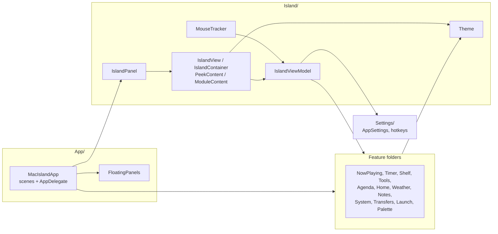
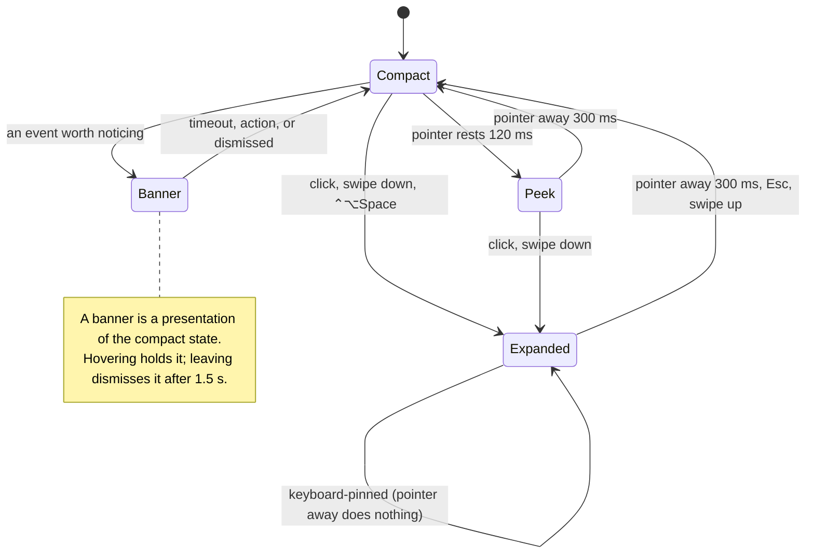
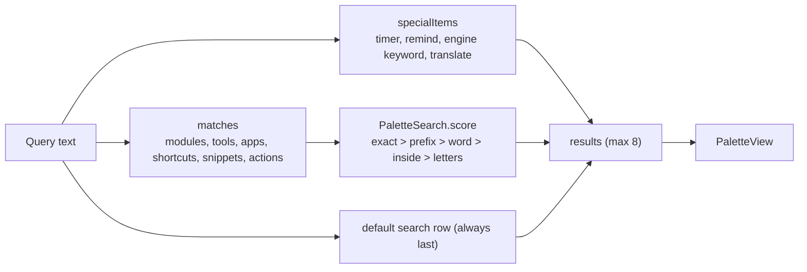
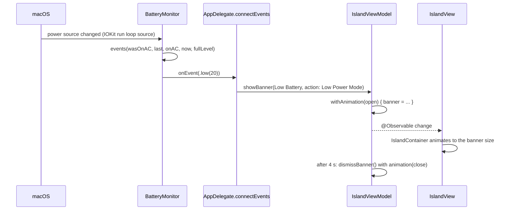

# Architecture

How MacIsland works. Back to the [README](../README.md). What it does: [FEATURES.md](FEATURES.md). Every file:
[SCRIPTS.md](SCRIPTS.md#source-map). The design rules: [../DESIGN.md](../DESIGN.md).

**Contents:** [The shape of the app](#the-shape-of-the-app) · [Startup](#startup) · [The panel and input](#the-panel-and-input) ·
[State: the view model](#state-the-view-model) · [Presentations](#presentations) · [Activities](#activities-what-is-live) ·
[Drawing](#drawing-container-surfaces-motion) · [Modules](#modules-and-the-tab-strip) · [Floating surfaces](#floating-surfaces) ·
[The palette](#the-command-palette) · [Data and events](#data-and-events) · [Storage](#storage) ·
[Permissions, network, and external commands](#permissions-network-and-external-commands) · [Testing](#testing) ·
[Gotchas and lessons](#gotchas-and-lessons)

---

## The shape of the app

A Swift package with one executable target (`MacIsland`) and one test target. Swift 6.3 toolchain, tools version 6.2, macOS 26,
compiled in **Swift 5 language mode** (`swiftLanguageMode(.v5)`), so strict concurrency is relaxed. There is no Xcode project:
`scripts/bundle.sh` wraps the built binary into `build/MacIsland.app`.

Layers, from the bottom:

1. **Feature models** are small `@MainActor @Observable` classes. Each owns one capability and has no UI knowledge.
2. **`IslandFeatures`** is a struct that holds one of each. It is the single thing tests replace with doubles.
3. **`IslandViewModel`** reads the features and owns the island's own state: presentation, selected tab, the current alert
   and banner, hover logic, sizes.
4. **Views** are thin. They read the view model and features, and call methods on them.
5. **`Theme`** is the only source of colors, type, metrics, and motion.

---

## Startup

`MacIslandApp` is a SwiftUI `App` with an `NSApplicationDelegateAdaptor`. It declares three scenes:

| Scene | What |
| --- | --- |
| `MenuBarExtra("MacIsland")` | The always-present capsule icon: Command Palette, Settings, Quit |
| `Settings` | The Settings window |
| `ModuleMenuBars` | One optional `MenuBarExtra` per module, inserted only when chosen in Settings |

`AppDelegate` builds everything in `applicationDidFinishLaunching`:

1. Sets the activation policy to `.accessory` (no Dock icon). Installs a SIGTERM handler so `pkill` quits cleanly and stops
   the adapter subprocess.
2. `connectEvents()` wires the monitors to the view model: timer and Pomodoro finish, battery, headphones, hotspot,
   downloads, unlock, agenda, drives and screenshots, file tools, lyrics, weather. Then starts the monitors.
3. Creates the `IslandPanel` hosting `IslandView`, sizes it for the screen, and shows it.
4. Creates the `MouseTracker`, and wires keyboard handling (Esc and arrows in the panel; the global hotkeys).
5. `connectReach()` wires torn-off windows (`onOpenWindow`) and the ⌃⌥K palette hotkey.
6. Observes screen changes to re-lay-out.

`AppDelegate.makeFeatures()` is the one place that builds the real `IslandFeatures`. `TestSupport.makeViewModel()` is its twin
for tests.

---

## The panel and input

### One panel

`IslandPanel` is a borderless, non-activating `NSPanel` at level `mainMenu + 3`, on every Space and over full-screen apps.
It is **always sized for the largest the island gets** (`ScreenGeometry.panelSize`, 560 x 260) and pinned to the top center
of the screen. The SwiftUI content is top-aligned inside it, so the visible island is only as big as its `size`.

### Click-through

Because the panel is bigger than the island, it would block clicks around it. So `ignoresMouseEvents` is **true except while
the pointer is over the visible island**. `MouseTracker` flips it, from global and local `NSEvent` monitors (mouse moved,
drags, clicks, scroll).

`MouseTracker` also:

- computes `inside` from the view model's `hitRect` (the island's screen-space rectangle), with one exception: a drag that
  *started* on the island keeps it "inside" until released, so the scrubber keeps working if the pointer wanders;
- detects **a file being dragged from another app** (the drag pasteboard's change count changed and holds a file URL), which
  makes the compact island grow into a bigger drop target. Other apps run their own drag loop, so it polls the cursor at 30 Hz
  from mouse-down until release;
- reports `setHovering(inside && !onCompactControl && canOpen)` to the view model. The compact play button is excluded so it can
  be clicked without opening the island;
- turns two-finger scrolls into swipes with `SwipeRecognizer`: down opens, up closes, left and right change tabs, once per
  gesture. Momentum after the fingers lift is ignored, and natural or traditional scrolling is honored;
- closes a keyboard-pinned island on a click outside it.

### Screen geometry

`ScreenGeometry.current()` finds the screen with a notch (`safeAreaInsets.top > 0`) and measures it from the auxiliary top areas.
Without a notch it falls back to a 200 pt "pill" as tall as the menu bar and `hasNotch == false`, which switches the island to a
glass surface that is hidden while nothing is live (its hover zone stays).

### Hotkeys

`GlobalHotkey` wraps Carbon `RegisterEventHotKey` (no Accessibility permission). Each instance has an id and only acts on its own
key: id 1 opens the island (⌃⌥Space, ⌃⌥I, or off; a Setting), id 2 opens the palette (⌃⌥K).

---

## State: the view model

`IslandViewModel` (`@MainActor @Observable`, with `@dynamicMemberLookup` into `IslandFeatures`) is the center. Its main state:

| State | Meaning |
| --- | --- |
| `state` | `compact`, `peek`, or `expanded` |
| `banner` | A banner in progress (shows as the `banner` presentation while `state == .compact`) |
| `alert` | The current alert, if any |
| `selectedTab` | The module shown when expanded (it need not be in the strip) |
| `isSwelling`, `isPinnedOpen`, `isFileDragActive` | Hover swell, keyboard-pinned open, a file being dragged |
| `toolsExpanded`, `calendarExpanded`, `clockMode`, `shelfMode`, `notesMode` | Per-module view state kept across tab switches |

It derives everything the views need: `presentation`, `compactActivities`, `compactPair`, `size` (per presentation), `hitRect`,
and a content height for each module (`contentHeight(for:)`, `mediaContentHeight(peek:)`). Heights are computed, not measured, so
the island can animate to a size before its content exists.

Timers that belong to the view model (hover dwell, close delay, alert and banner timeouts) are `Task`s that it cancels and
replaces. Nothing polls while idle.

---

## Presentations

The presentation decides the size and corner radius: compact uses a small radius, everything that hangs below the notch uses the
large one (32, continuous). Peek and banner share a width (380), so one becomes the other by changing height only.

---

## Activities: what is live

`compactActivities` builds a ranked list from the features (banner, alert, microphone, timer, Pomodoro, stopwatch, working,
download, music). The island shows the **top two**. A pair shows each activity's glyph, ring, or artwork at `notch height + 8`;
an alert always stands alone, because its text is the message. `compactActivity` (singular) is the top of the list, and it
decides what the peek shows. The table is in [FEATURES.md](FEATURES.md#live-activities).

`WorkTracker` is the general "busy" list (zipping, converting, running a Shortcut): call `begin(title)`, later `end(id)`, and a blue
"working" activity shows while any job runs.

---

## Drawing: container, surfaces, motion

### `IslandContainer`

Takes a presentation, a size, a surface, and content, and draws the island: the `NotchShape` outline (flat top that meets the
bezel, concave flares at the top corners like the hardware notch, continuous bottom corners), the fill, the pixel-aligned frame, and
the hover swell. `IslandView` supplies what goes inside, switching by presentation with a content transition.

### Surfaces

| Surface | Where | Material |
| --- | --- | --- |
| Island | The hardware notch | Opaque `#000000`. Never glass |
| Glass pill | Displays with no notch | `.glassEffect(.regular)`, forced dark; hidden while nothing is live |
| Floating | The palette, menu-bar windows, torn-off windows | `.glassEffect(.regular)` in the system appearance, with a shadow |

Glass is never used inside the island, and never on top of glass.

### `Theme.Palette` follows the surface

`Palette.primary`, `.secondary`, `.tertiary`, `.fill`, and the rest are not `Color`s but `SurfaceInk`, a `ShapeStyle` that reads
the `\.islandSurface` environment value: white opacities on the island, the system's adaptive primary color on glass. `.inverse` is the
content color on a `.primary` fill (black on the island; the window color on glass), and `.none` is a clear of the same type, so a
ternary can pick between them. This is why one `ModuleContent` view can draw on the island, in the menu bar, and in a torn-off window.
Live tint colors (`Theme.Tint`, the album accent) are plain `Color`s.

### Motion

Tokens in `Theme.Motion`: `open` (a spring with one small settle: compact to peek or expanded, alerts arriving), `close` (critically
damped: never overshoots into the hardware), `resize` (changes inside an open island), `track` (pointer-driven: the swell), `float`
(glass appearing), and `content` (a blur-fade for content swapping while the shape morphs). Reduce Motion turns each into a short
ease and removes the swell.

The compact island's album art and sound bars share a `mediaNamespace` (`matchedGeometryEffect`) with the peek and the Media tab, so
they travel to their new places when it opens.

---

## Modules and the tab strip

`IslandModule` is the list of modules (`home, media, shelf, clock, reminders, tools, agents, notes`). `isAvailable` says which have
views (`agents` is reserved and has no view). `ModuleContent(module:viewModel:)` is the one switch that maps a module to its view, used by the
island, menu-bar windows, and torn-off windows alike.

`AppSettings` holds `leftTabs` (up to 5) and `rightTabs` (up to 1) as ordered arrays, with `move`, `setEnabled`, and `nudge` that keep
the rules (capacity, no duplicates, never empty). `TrailingStrip.plan(...)` decides which of the weather and the New Note pencil fit
right of the notch, from known worst-case widths; it is a pure function with tests.

---

## Floating surfaces

`FloatingGlassPanel` is an `NSPanel` in two styles: **palette** (borderless, non-activating, takes the keyboard like Spotlight) and
**window** (resizable, moved by its background, no chrome, closed by its own button). It can pin its top edge (so the palette grows
downward) and can be kept on the desktop by dropping its level to `desktopIconWindow + 1` on every Space.

`FloatingPanels` owns the torn-off windows, one per module. `DetachedModuleView` is the glass window's content: a small header (title,
Keep on Desktop, Close) over `ModuleContent`. `ModuleMenuBars` declares a `MenuBarExtra` per module, bound to
`settings.isInMenuBar`; `MenuBarModuleView` is its window, with a header you can drag away to tear off.

`\.isFloatingWindow` tells module views they are not in the island, so typing in a floating window does not pin the island open.

---

## The command palette

`PaletteModel` builds `PaletteItem`s (title, subtitle, icon, an action closure) and ranks them; `PaletteController` owns the panel, reads the
arrow, Return, and Esc keys in `sendEvent` (so the text field does not swallow them), and closes on resigning key. Apps and Shortcuts are
read in the background when it opens (`LaunchModel`). Translation runs in the view through `.translationTask`, and the model moves through
`idle`, `working`, `done`, `failed`.

---

## Data and events

Monitors push events; the view model turns them into what you see.

The pure logic of each monitor (what counts as an event) is a static function so it can be tested without hardware.

---

## Storage

Nothing is stored except these. All keys are in `UserDefaults` (the app's domain, `com.ethantiller.MacIsland`) unless noted.

| What | Where | Key or file |
| --- | --- | --- |
| Open shortcut | UserDefaults | `hotkey` |
| Quiet in Focus | UserDefaults | `quietDuringFocus` |
| Calendar events / due reminders in Up Next | UserDefaults | `showsCalendar`, `showsReminders` |
| Weather city | UserDefaults | `weatherCity` |
| Left and right tabs | UserDefaults | `tabsLeft`, `tabsRight` (legacy `tabs` is read once) |
| Menu-bar modules | UserDefaults | `menuBarModules` |
| Synced lyrics on/off | UserDefaults | `showsLyrics` |
| Default search engine, custom engines | UserDefaults | `searchEngine`, `customSearchEngines` (JSON) |
| Full-charge level | UserDefaults | `fullChargeLevel` |
| Tools in the row, and the pinned order | UserDefaults | `pinLimit`, `pinnedTools` |
| Shelf files | UserDefaults | `shelf.paths` (paths only; the files stay where they are) |
| Pomodoro history | UserDefaults | `pomodoro.history` (JSON: sessions per day) |
| Notes and snippets | JSON file | `~/Library/Application Support/MacIsland/notes.json` |
| Clipboard history | Memory only | Never written to disk |
| Lyrics cache | Memory only | Per track, per launch |

---

## Permissions, network, and external commands

### Permissions

macOS asks when a feature first needs access. `Support/Info.plist` holds the reasons.

| Access | Asked for by | `Info.plist` key |
| --- | --- | --- |
| Calendars (full) | Up Next, meeting banners | `NSCalendarsFullAccessUsageDescription` |
| Reminders (full) | Reminders tab, adding, due banners | `NSRemindersFullAccessUsageDescription` |
| Bluetooth | Headphones banner | `NSBluetoothAlwaysUsageDescription` |
| Focus status | Quiet in Focus, Focus tool | `NSFocusStatusUsageDescription` |
| Downloads folder | Download progress | `NSDownloadsFolderUsageDescription` |
| Automation (Apple Events) | Music and Spotify: volume, Favorite, play/pause | `NSAppleEventsUsageDescription` |
| Accessibility | Clean Keys (an event tap) | (system prompt; no key) |

`LSUIElement` is true (no Dock icon). The app is **ad-hoc signed**, so each rebuild is a new identity to macOS and permissions ask
again; `tccutil reset All com.ethantiller.MacIsland` clears them on purpose.

### Network

| Host | For | What is sent |
| --- | --- | --- |
| `geocoding-api.open-meteo.com`, `api.open-meteo.com` | Weather | The city name; then coordinates |
| `lrclib.net` | Synced lyrics | Track name, artist, album, length (off in Settings) |

Web searches are opened in your default browser. There is no analytics and no account.

### External commands

| Command | For |
| --- | --- |
| `/usr/bin/perl` running `mediaremote-adapter.pl` | Now Playing state and commands (see below) |
| `/usr/bin/ditto` | Zip and unzip |
| `/usr/sbin/screencapture` | The Screenshot tool |
| `/usr/bin/shortcuts` (`list`, `run`) | Shortcuts in the palette |
| `system_profiler SPBluetoothDataType -json` | Headphone battery levels |
| `NSAppleScript` | Music and Spotify control, Low Power Mode (`pmset` with an admin prompt); the dark-mode script in `SystemActions` is unused |

### Now Playing

Apple restricts MediaRemote to its own binaries since macOS 15.4, so the vendored `mediaremote-adapter` is compiled to a framework and
loaded by `/usr/bin/perl`, which Apple *does* entitle. `MediaRemoteAdapter` runs its `stream` command and parses JSON lines (full
snapshots, then diffs) into `NowPlayingState`; commands go through `send`, `seek`, `shuffle`, and `repeat`. For Music and Spotify,
transport goes through AppleScript instead, addressed to the app itself. See [SCRIPTS.md](SCRIPTS.md#build-adaptersh).

---

## Testing

`./scripts/test.sh` runs Swift Testing (`import Testing`) in the `MacIslandTests` target: **216 tests** in about a second, no real
hardware or network. Patterns:

- **`TestSupport.makeViewModel()`** builds a view model from test doubles (temp folders, private `UserDefaults` suites, an adapter-less
  `NowPlayingModel`).
- **Pure logic is static and separate**: battery events, LRC parsing, ranking, timer and translation parsing, the strip plan, zip
  arguments. Networks and shells are replaced by injected closures (`fetch`, `sendToPlayer`).
- **Timing tests poll** rather than sleeping an exact time (`hoverSwellsThenPeeks`), since the suite runs in parallel.
- **`IslandSnapshots`** (opt-in with `ISLAND_SNAPSHOT_DIR`) renders each state to PNG for review and for the docs. It cannot draw glass,
  text fields, or horizontal scroll views.

Map of the test files: [SCRIPTS.md](SCRIPTS.md#tests).

---

## Gotchas and lessons

Things that cost time. Read before changing the related code.

| Area | Lesson |
| --- | --- |
| **Scene recursion crash** | A `MenuBarExtra`'s `isInserted` binding writes back the value it reads. A setter that mutates an `@Observable` array *even when nothing changes* counts as a change, so SwiftUI updates, writes again, and recurses until the app crashes (opening Settings showed it). Setters called by bindings must do nothing unless something changes. A test guards `setInMenuBar`. |
| **`@Entry` macro** | Not available with the Command Line Tools (no SwiftUI macro plugin). Environment keys are written by hand (`EnvironmentKey` plus an `EnvironmentValues` extension). |
| **Play/pause with two players** | The system's toggle goes to whatever macOS thinks is playing, which is a browser video once one starts. Music and Spotify are told directly by AppleScript. Browser tabs cannot be told apart. |
| **Hover timing** | A "pointer left" step schedules a close 300 ms later; in tests and snapshots that can land mid-way. Set the state you need right before rendering. |
| **ImageRenderer** | Draws a drop target as a yellow placeholder (turned off with `acceptsDrops: false` in snapshots), and skips Liquid Glass, text fields, and horizontal scroll views. Check those in the app. |
| **Idle CPU** | Budget: about 0.1 to 0.3% with nothing live. `top`'s %CPU misleads; measure with `ps -o cputime= -p PID` over 10 s. No timers run while nothing is live, and samplers run only while their view is visible. The first minute after launch is busier (the Spotlight screenshot query gathers). |
| **Permissions reset** | Ad-hoc signing means every rebuild forgets them. Expect prompts again. |
| **Panel size** | `panelSize` must be at least the widest presentation (expanded is 520; the panel is 560). |
| **Tab order** | Tab order is the order the person arranged, not module order; `normalized` keeps it. |
| **Right side of the strip** | Widths are worst-case constants in `TrailingStrip`; if a new item goes there, add it to `TrailingStrip.plan` and its test, or it can reach the notch. |
| **Blur while pinning** | Focusing a text field calls `holdOpen()`; floating windows must not (`\.isFloatingWindow`). |
| **File drags from other apps** | The source app runs its own drag loop, so the island stops getting mouse events; `MouseTracker` polls the cursor at 30 Hz from mouse-down until release. A drag counts as a file drag only if the drag pasteboard's change count moved since mouse-down **and** it holds a file URL. (An early version used `canReadObject(forClasses:)`, which also matched links and URL-like text, and grew the island with no file.) Not checked against every source app; if it misfires, note what was being dragged. |
| **Hover during a drag** | While a file is dragged, hovering must not open the island (only the drop target does), but hovering may keep it open. `setDropTargeted` sets `isHovering` so it still closes when the pointer leaves. Drop halves are decided from the drop location (`x > width / 2` is AirDrop), which keeps working while the island resizes. |
| **AirDrop** | Incoming can't be intercepted (the Accept/Decline notification belongs to `sharingd`; nothing is observable until the file starts arriving in Downloads, where `TransferMonitor` shows it). Sending is picker-only. See [ROADMAP.md](ROADMAP.md#dropped-for-good). |
| **Snapshots and drags** | Drag and drop states can't be simulated in `ImageRenderer`; check them in the running app. |
| **No Python here** | Scripted edits in this environment used `perl`; the repo itself has no Python. |
