# Features

Everything MacIsland does, in the order you meet it. Back to the [README](../README.md). How it is built:
[ARCHITECTURE.md](ARCHITECTURE.md). What is left: [ROADMAP.md](ROADMAP.md).

**Contents:** [Presentations](#presentations) · [Live activities](#live-activities) · [Alerts and banners](#alerts-and-banners) ·
[The tab strip](#the-tab-strip) · [Modules](#modules) · [The `macisland://` link](#the-macisland-link) ·
[Menu bar and windows](#menu-bar-and-windows) · [Settings](#settings) · [Keys and gestures](#keys-and-gestures) ·
[Accessibility](#accessibility)

---

## Presentations

The island is always in one of four presentations. Sizes are in points.

| Presentation | When | Shows | Size |
| --- | --- | --- | --- |
| **Compact** | Something is live | One activity split around the notch, or two as a pair | Notch plus a side on each end |
| **Banner** | An event worth noticing once | Glyph, title, one detail line, at most one action | 380 wide, or 290 when it has nothing to press (an alert); notch + 56 tall |
| **Peek** | Pointer rests on the island (swells at once, opens after 120 ms) | The top live activity at full size, no tabs. With nothing live, the day and everyday tools | 380 wide |
| **Expanded** | Click, two-finger swipe down, or ⌃⌥Space | The tab strip and the selected module | 520 wide |

The pointer leaving for 300 ms folds it back in. Opening it with the keyboard (⌃⌥Space) *pins* it open until Esc, the
shortcut again, or a click outside. Focusing a text field pins it too, so it does not close while you type.

### The music peek and the Media tab

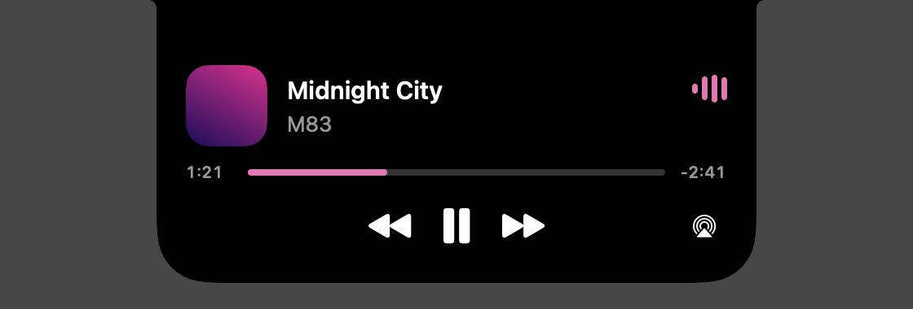
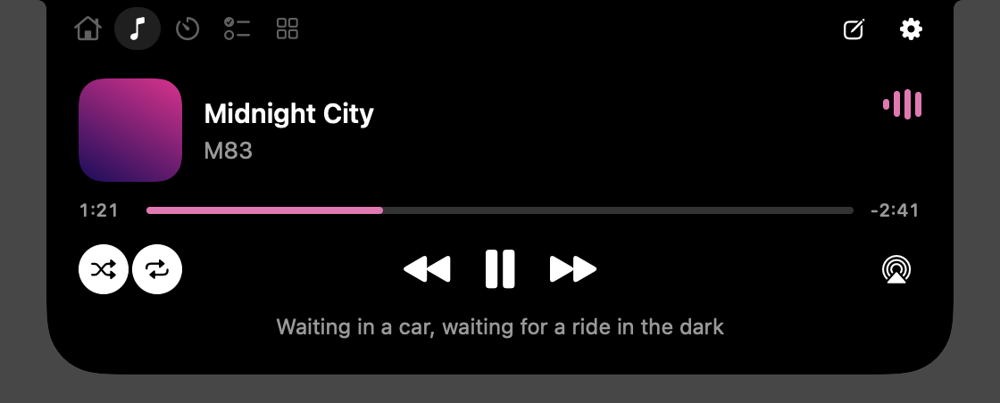

The peek is the Dynamic Island's own layout: album art, the song in bold over the artist, sound bars at the far side, a
scrubber, and big centered transport buttons. The compact island's artwork and sound bars *travel* into place when the peek
opens instead of appearing. The Media tab is the same with larger art, shuffle and repeat on the left, and Favorite and
AirPlay on the right.

### The idle peek

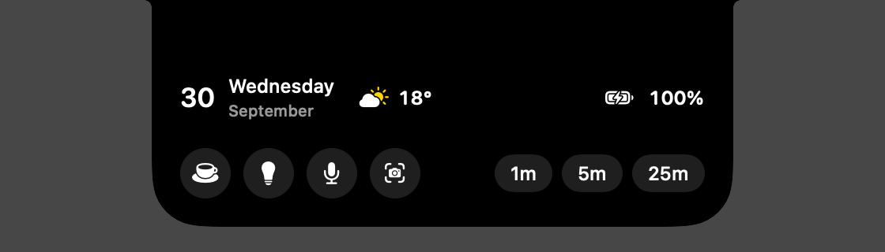

Nothing live: the date, the weather (if a city is set), what is next (or this Mac's battery), your first four pinned tools,
and `1m` / `5m` / `25m` timer chips.

### Timer, Pomodoro, and stopwatch peeks

Each is the ring and its controls, sized to the 380 pt peek: the timer shows when it ends and `+1m` / `+5m`; the Pomodoro
shows the session, the streak, and what is next; the stopwatch shows the lap in progress and the last lap.

---

## Live activities

Compact shows the **top two** live activities, ranked. Highest first:

| Rank | Activity | Left of the notch | Right of the notch |
| --- | --- | --- | --- |
| 1 | Banner | (a banner is a presentation of its own) | |
| 2 | **Alert** (always shown alone: its text is the message) | Glyph | Text |
| 3 | **Recording** (the screen, or a voice note) | Record dot or waveform, blue | How long |
| 4 | **Microphone in use** (another app) | The app's icon | How long |
| 5 | **Timer** | Ring | Countdown |
| 6 | **Pomodoro** | Ring | Countdown |
| 7 | **Stopwatch** | Stopwatch glyph | Elapsed |
| 8 | **Working** (zipping, converting, running a Shortcut) | Pulsing gear, blue | What it is doing |
| 9 | **Download in progress** | File icon in a ring | Percent |
| 10 | **Music** | Album art | Play/pause, or sound bars while playing |

In a pair, each side shows only its activity's glyph, ring, or artwork. Music's play/pause button is left out of a pair. A screen recording is one big stop button: click the compact island to stop it, and hovering does not open it. A voice note peeks with the time, a level meter, and **Stop**.

### Color

A tint means something is live, one meaning per color. Everything else is white on black.

| Tint | Means |
| --- | --- |
| The album art's most vivid color | Music |
| Orange | Time: timer, stopwatch, Pomodoro |
| Blue | In progress: zipping, converting, running a Shortcut |
| Green | Done or connected |
| Red | Needs you: low battery, missing permission, a failure |

---

## Alerts and banners

An **alert** is a short message beside the notch. A **banner** drops below it with a title, a detail line, and at most two
actions (with two, the first is filled). Alerts that need you (a timer finishing, a Pomodoro phase ending) stay until you open the island.

| Event | What you see |
| --- | --- |
| Charger plugged in | Alert: a bolt with a green ring drawing around it, and the percent |
| Battery hits **20%** or **10%** | Red alert "Low Battery", "18% remaining", centered, with nothing to press (Low Power Mode needs an administrator's password every time, so it isn't offered anywhere) |
| Battery reaches your full-charge level (80 to 100%, Settings) | Green alert while charging |
| Headphones connect (Bluetooth) | A small centered alert: the AirPods (or headphones) inside a ring that draws once around them as the charging bolt's does, green, or red when an earbud is at 20% or less, with the name and the left, right, and case battery |
| An external drive mounts | Banner with the name, size, and **Eject** (then "Ejected", or the reason it failed) |
| A screenshot is saved | Green "Shelf" alert; the file is added to the Shelf |
| A meeting is 5 minutes away | Banner, with **Join** and **Check Camera** if it has a Zoom, Meet, Teams, or Webex link |
| A reminder comes due | Banner, with **Done** |
| Timer or Pomodoro finishes | Alert that stays until seen; opens the Clock tab |
| A download finishes | Green "Saved" alert |
| A color is picked | Alert tinted with the color, and the hex code (also copied) |
| Something is copied from the island | "Copied" |
| Personal Hotspot connects | Green alert |
| The Mac unlocks | "Unlocked" with a Touch ID glyph |
| Zip, convert, or a Shortcut finishes | Green "Zipped", "Converted", "Done"; or a red banner with the reason |
| Rain is due within 30 minutes (only with a city set) | Banner "Rain Soon", "Starts around 3:45 PM"; once per rain spell, and again only after a dry hour |
| Free space falls under 10 GB | Red banner "Low Disk Space", "8.2 GB free", with **Open Storage**; a red alert stays until seen. Checked on unlock, on wake, and after a finished job or download, never on a schedule; it warns again only after space passes 15 GB |

**Quiet in Focus** (Settings): while a Focus is on, banners and short alerts are held back. Alerts that stay until seen, and
feedback to something you just did, still arrive.

---

## The tab strip

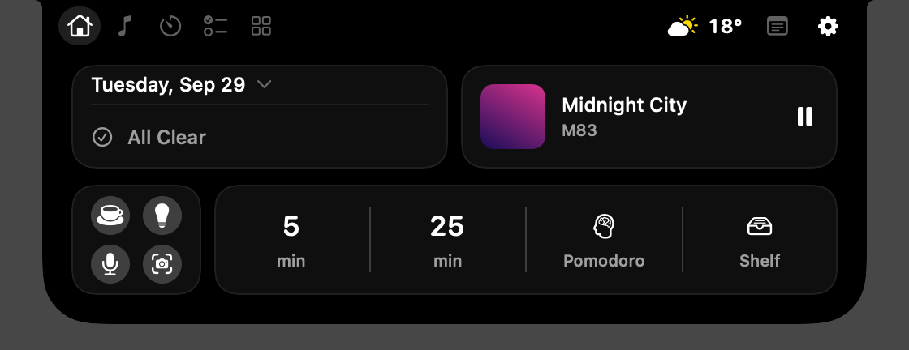

Left of the notch: up to **five tabs**. Right of the notch, from the notch outward: live status (a running clock, or a glyph
for hotspot, Ring Light, Keep Awake, or a locked keyboard), the **weather**, the **New Note** pencil, up to **one tab**, and
**Settings**.

Space on the right is limited, so it fills in this order and never reaches the notch: Settings, the right-hand tab, live
status, then the weather, then the pencil. The pencil is left out when Notes is already a tab. Right-click a tab for
*Show in Menu Bar* and *Open in Window*.

Arrange the tabs in **Settings**: three lists (Left of the Notch, Right of the Notch, Not Shown). Drag a row to reorder it or
to another list; each row has an on/off switch, and a right-click menu has Move Up/Down and Move to Left/Right. The last tab
cannot be turned off.

---

## Modules

Seven are built. The default tabs are Home, Media, Clock, Reminders, and Tools. Shelf and Notes are in Not Shown but still
open other ways (dropping a file opens Shelf; the pencil opens Notes).

### Home

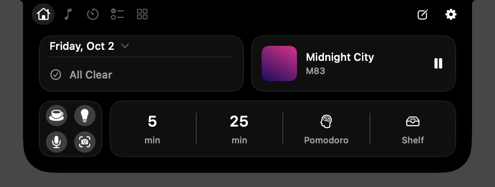

A dashboard of widgets in rows of boxes that share the same left and right edges. This is the default layout (**Everyday**);
Home & Widgets in Settings arranges it (see below).

- **Top left**: today on one line (tap it for a **month calendar**, six weeks with arrows; today is a filled circle), over
  **Up Next**: the next meeting or due reminder (tap to join a call, or open Reminders). Reads Calendar and Reminders only
  if you turn them on in Settings.
- **Top right**: what is playing, with play and pause (tap for the Media tab).
- **Bottom left**: your first four pinned tools as a 2 by 2 of round buttons. White fill means on.
- **Bottom right**: one segmented pill: `5 min`, `25 min`, `Pomodoro`, `Shelf`. While a timer, Pomodoro, or stopwatch runs,
  its segment shows the running time instead; tap it to open the Clock tab.

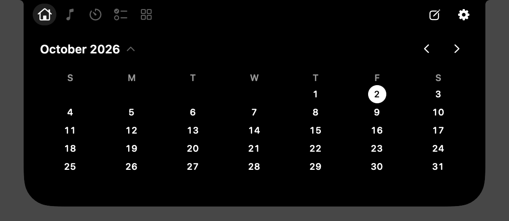

**Widgets.** Home is a grid of 6 columns by up to 3 rows (472 pt wide, 64 to 212 pt tall): each widget takes one of a few sizes, and Home is exactly as tall as its rows. Widgets fill in reading order, so removing one closes the gap. Built in: **Today** (date and Up Next),
**Music**, **Quick Tools** (a 2 by 2 of round buttons; your first four pinned tools, or four you pick), **Timers & Shelf** (two
timer lengths, Pomodoro, Shelf; each can be changed or hidden), **Weather** (the city from Settings; the unit follows macOS's
own Temperature choice), **Battery** (red at 20% or less, not charging), **Reminders** (the first two, checked
off in place), and **Note** (the first lines of your latest note, or one you pick). Presets: **Everyday** (the default),
**Focus**, **Listening** (the player at 6 by 2), **Minimal**, and **Dashboard** (music, weather, today, tools, and timers in three rows). A widget that doesn't fit goes off Home, with its options and size, never deleted. (The old Timer Chips widget is now Timers & Shelf.)

**Sizes.** Each widget has a few sizes (columns by rows), each with its own layout. Change one in Settings, under **Size** in the widget's options; a size that would leave something off Home is dimmed.

| Widget | Sizes (default first) |
| --- | --- |
| Today | **3 × 1**: date line and Up Next; 2 × 1: short date and Up Next; 3 × 2: the next three; 3 × 3: the month |
| Music | **3 × 1**: art, song, play; 2 × 1: art, play, next; 6 × 1: art, song, back, play, forward; 3 × 2 and 6 × 2: the player with scrubber |
| Quick Tools | **1 × 1**: a 2 by 2 of round buttons; 2 × 1: four in a row; 3 × 1: six; 6 × 1: eight named buttons; 6 × 2: every tool |
| Timers & Shelf | **5 × 1**: timers, Pomodoro, Shelf; 2 × 1: the timers; 3 × 1: and Pomodoro; 4 × 1 and 6 × 1: and Shelf |
| Weather | **1 × 1**: symbol, temperature, place; 2 × 1: and the condition; 3 × 1: and the high and low; 6 × 1: now and the next five hours; 3 × 2: now and five days |
| Battery | **1 × 1**: percent; 2 × 1: and whether it is charging |
| Reminders | **3 × 1**: two, with due text; 2 × 1: two, titles only; 3 × 2 and 6 × 2: four |
| Note | **3 × 1**: the title and two lines; 2 × 1: one line; 3 × 2 and 6 × 2: up to six |
| Your own | **2 × 1**: glyph beside the value; 1 × 1: glyph over the value; 3 × 1 (a button has 1 × 1 and 2 × 1) |

The forecast comes in the same Open-Meteo request and 30-minute refresh as the temperature: no new host.

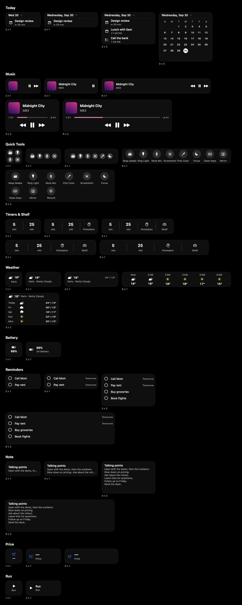

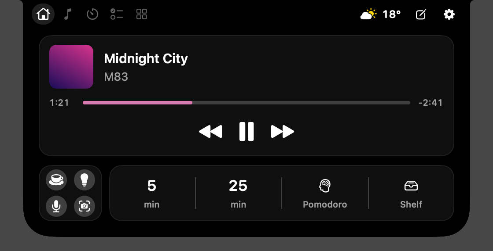

### Meetings, Outlook, and Teams

Up Next and the 5-minute banner read every calendar in System Settings → Internet Accounts, so **Outlook, Microsoft 365, Exchange, and
Google calendars appear once the account is added there** (Settings → Up Next has a button that opens it). The new Outlook for Mac
keeps its own store, which macOS can't read; add the account to Internet Accounts as well.

**Join** opens the meeting app when there is one: a Teams `https://teams.microsoft.com/l/…` link opens Teams (`msteams:`), and a Zoom
`/j/<id>` link opens Zoom (`zoommtg:`), each only if this Mac has that app; otherwise it opens the link in your browser.
Outlook SafeLinks and Google redirect links are unwrapped to the real address first.

### Media

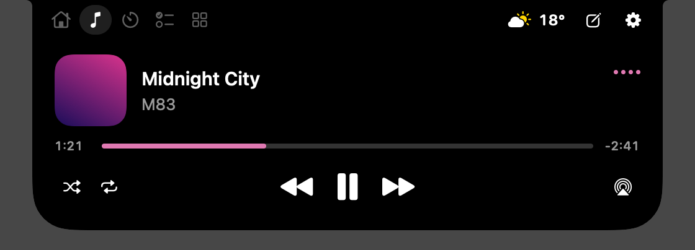

- **Now Playing** from any app, through the bundled adapter. The artwork's most vivid color tints the scrubber and bars.
- **Transport**: back, play/pause, forward; scrub; **shuffle** and **repeat** (off, all, one).
- **Music and Spotify are controlled directly**, so play/pause hits *that* app even while a video plays elsewhere. Other
  apps use the system's command.
- **Favorite** (Apple Music only) is a heart. **App volume** (Music and Spotify) is a slider beside the output chips, behind
  the AirPlay button. **Audio output**: chips for each output device, then a *Not Connected* group with your paired Bluetooth headphones and speakers: click one to connect it (blue "Connecting" while it works; the headphones banner confirms, or "Couldn't Connect"). Right-click a connected Bluetooth output to *Disconnect*. The paired list is read only when the picker opens. In the palette, `connect airpods` finds them too.
- **Synced lyrics** under the scrubber, from LRCLIB, while the track has them. Turn off in Settings.
- Compact: the artwork and, on the right, a play button that becomes bouncing bars while playing. Click it to play or pause.

### Shelf

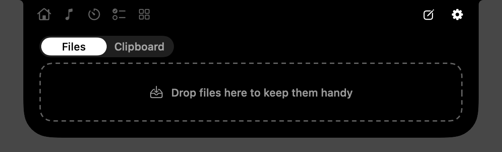

A **Files / Clipboard** choice. **⌃⌥S** (Settings → General → Shortcuts → Open the Shelf) opens the island straight on the Shelf
from anywhere, pinned like ⌃⌥Space, even when the Shelf isn't in the tab strip; pressing it again on the Shelf closes it.

- **Files.** Drag files onto the island (the left half is *Add to Shelf*, the right half is *AirDrop*, drawn in AirDrop blue while a file is dragged). Only references are
  kept; files stay where they are. Each file shows its own preview (QuickLook thumbnails, kept in memory only; the file's icon until one arrives), centered in the row. Double-click opens, drag out to copy it where you drop it (the original never moves), hover for an ✕ that takes it off the Shelf. **Space** over an item previews it with
  Quick Look. **Right-click** an item for *Quick Look*, *Share* (the system menu), *Copy Text from Image* or *Copy Text from PDF*, *Zip*, *Unzip*,
  *Convert To*, *Resize* and *Compress* (images), or *Show in Finder*. **Zip All** zips everything; **Combine into PDF** joins
  two or more images and PDFs. **A result asks where it goes.** Zip, Unzip, Convert To, Resize, Compress, and Combine make their file in a temporary staging folder, and the Shelf shows it with three choices: **Add to Shelf** (the file moves into `~/Library/Application Support/MacIsland/Shelf Results`, and goes to the Trash if you later take it off the Shelf), **Replace** (it takes the original's place on the Shelf; the original file on disk is never touched), or **Save to Folder…** (the system save panel; cancelling it leaves the choice waiting). The ✕ throws it away. If the island folds first, the result keeps waiting, and a green alert stays until you open the island on the Shelf. New screenshots, recordings, and voice notes still go straight to the Shelf.
  - **Copy Text from Image** (and from a PDF) reads the text in an image (and any QR code) with Vision, on this Mac, and copies it. A PDF's own text is used
    first; only pages without text are read as images, up to 10. It says *Copied*, or *No Text Found*.
  - **Convert To** is offered for every kind, and never lists the format the file already is:

    | From | To |
    | --- | --- |
    | Images | HEIC, PNG, JPEG, TIFF, PDF |
    | DOCX, DOC, RTF, RTFD, ODT, TXT, HTML, Markdown | PDF, DOCX, RTF, TXT, HTML, ODT |
    | PDF | TXT; PNG or JPEG (one file per page, in a "name Pages" folder) |
    | MOV, MP4, M4V | MP4, M4A (audio only), GIF (the first 15 s, 12 fps, up to 640 px) |
    | WAV, AIFF, MP3, CAF | M4A |

  - **Word fidelity.** Documents use TextEdit's engine: text, fonts, lists, simple tables, and images survive; headers, footers,
    footnotes, text boxes, and tracked changes do not.
  - **Resize** is half size, or 1920 or 1280 px on the long edge (never larger than the original); **Compress** makes a JPEG at
    quality 0.7.
- **Clipboard.** The last ten things you copied, text and images, in memory only (never written to disk). Copies that
  password managers mark as concealed are skipped. Click a card to copy it again; drag it out. Text that is *entirely* a
  link, an email address, or a `#hex` color gets one action: **Open**, **New Email**, or **Copy RGB** (with a swatch). An
  image card shows the picture and nothing over it; right-click it for *Copy Text from Image* (Vision, on this Mac). Right-click a text card for *Copy as Plain Text* (the string only, no other types) or *Save as
  Snippet* (kept in Notes, and written to disk because you chose to). History itself stays in memory.

### Clock

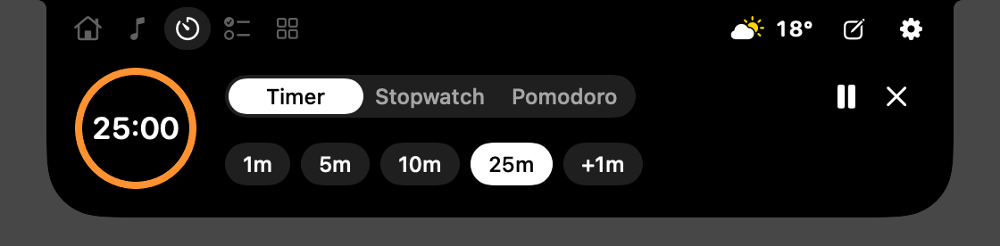

Timer, Stopwatch, and Pomodoro share one tab.

- **Timer**: presets 1, 5, 10, 25 minutes, `+1m`, pause and cancel. Before it starts, a **minute dial** sets the length
  (1 minute to 24 hours): a ruler that slides under a fixed marker and fades toward both edges. **Drag** it (the ruler follows
  the pointer 1:1), **swipe** it sideways with two fingers (it coasts, and fingers left pull later minutes in), **tap** a tick
  to glide it under the marker, or use a **mouse wheel** for a minute a notch. It stretches with resistance past 1 minute and
  at 24 hours, with a tap of haptics. A vertical swipe over the dial still closes the island, and a horizontal swipe anywhere
  else still changes tabs.

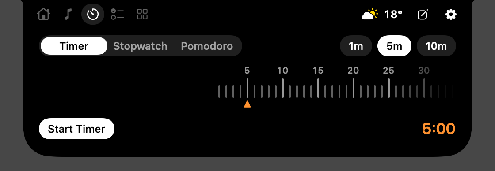
- **Stopwatch**: start, stop, laps (the lap in progress and the last lap), reset. Drift-free.
- **Pomodoro**: 25-minute focus sessions, 5-minute breaks, and a 15-minute break after the fourth, unless you set other
  lengths in Settings → Content → Clock (focus 1 to 90 minutes, short break 1 to 30, long break 5 to 60, 2 to 8 sessions before the
  long break). A phase that is running keeps its length and a change applies from the next one; the ring follows a change
  at once while nothing runs. Sessions **chain**
  automatically and stop after the long break. A **streak** counts consecutive days with a finished session, and a
  **7-day bar chart** shows sessions per day.

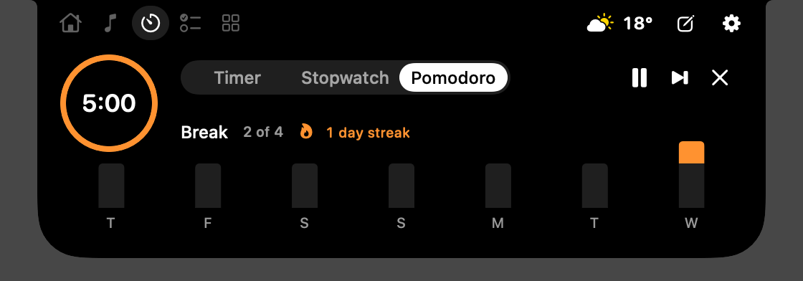

### Reminders

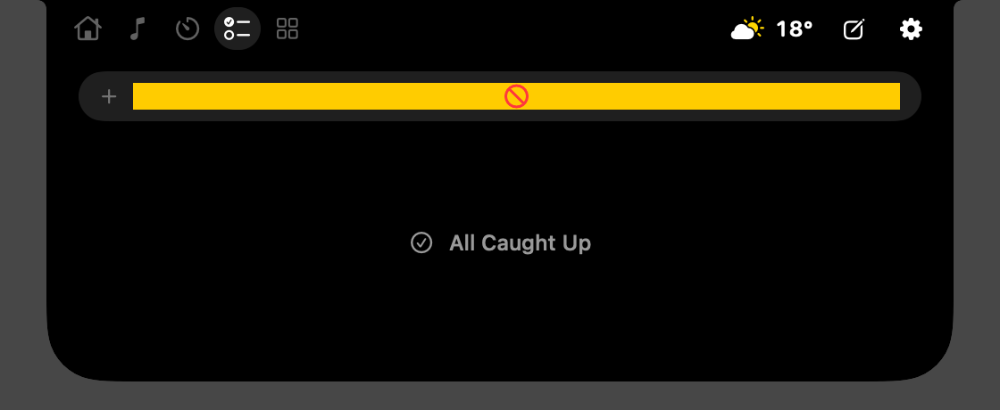

An add field (Return saves to your default Reminders list), then your open reminders, soonest and most overdue first, then
undated ones. Tap the circle to check one off. Asks for Reminders access the first time.

### Tools

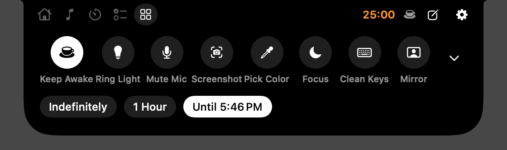

Nine tools, and up to two **Shortcut tools** of your own. The row shows **4, 6, or 8** of them (Settings); the rest are behind a chevron, in a grid of two rows of six.

**Shortcut tools.** Settings → Content → Tools → **Add Shortcut Tool…** makes a tool from one of your Shortcuts: choose the Shortcut from the list (`shortcuts list`), a label of up to 14 characters, and an icon (an SF Symbol: a name, a preview, sixteen common ones, `bolt.fill` to start). **Test** runs it once. Pressing the tool runs the Shortcut with no input: the blue working activity while it runs, a green *Done* alert, or a red banner with the reason if it fails. It can be pinned to the row and shows in Quick Tools and the grid like any tool; right-click it in the Tools tab to edit or remove it (removing never touches the Shortcut). If the Shortcut was renamed or deleted the tool is dimmed, and its banner offers **Edit Tool**. The icon the Shortcuts app shows can't be read honestly, so you choose one ([docs/plans/shortcut-icons.md](plans/shortcut-icons.md)). Shortcut tools are in the settings file (their names, not the Shortcuts).
Right-click a tool to pin it. The row is always full: unpinning fills the gap with another tool.

| Tool | Does |
| --- | --- |
| **Keep Awake** | Stops the display sleeping (and also asks macOS not to sleep the system). Chips choose *Indefinitely*, *1 Hour*, or *Until* an hour you pick, and say "A shut lid can still sleep it": closing the lid of a Mac that isn't on power with an external display sleeps it whatever is asked, and MacIsland asks for no password to change that. After a wake, if macOS dropped the hold, the tool shows Off |
| **Ring Light** | A soft white glow around the screen edge, for video calls; brightness and width sliders |
| **Mute Mic** | Mutes the default input device |
| **Pick Color** | The system eyedropper; copies the hex code |
| **Screenshot** | Area capture to the clipboard |
| **Focus** | Turns a Focus on or off through *your* Shortcuts named `Focus On` and `Focus Off` (a banner explains if missing) |
| **Clean Keys** | Swallows every key for 30 seconds so the keyboard can be wiped; the mouse still works. Needs Accessibility |
| **Mirror** | Replaces the tools with your camera (16:9, mirrored, no frames kept), Ring Light and its brightness beside it, and **Done**. The island stays open for as long as the camera is on: it does not fold when the pointer leaves, on a click outside, Esc, the shortcut, or a swipe up, and a banner waits as an alert; tab swipes and the arrow keys are ignored. Done, clicking another tab, or the camera failing turns it off. Asks for Camera access the first time, and says so, with **Open Settings**, if it is off |
| **Record** (*Record Screen*) | Folds the island and lets you drag a region (click for the whole display, Esc to cancel), then records it, without MacIsland's own windows, to a movie in your Movies folder (30 minutes at most). The blue record dot and time sit beside the notch; click it to stop. The movie lands on the Shelf. Asks for Screen Recording access, with a red banner and **Open Settings** if it is off |

### Notes

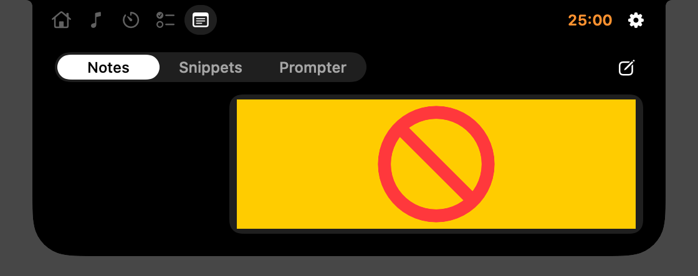

Notes, Snippets, and a Prompter, stored as JSON in Application Support.

- **Notes**: a list and an editor. A note is named by its first line.
- **Snippets**: named text you copy in one tap.
- **Prompter**: the selected note, scrolling under the camera at a speed you set, with fade at the edges.
- **Voice Note** (the mic in the header): records audio and turns it into text on this Mac (macOS speech recognition; the language model is downloaded once). Stopping makes a note called "Voice Note, 3:45 PM" that holds the words, and puts the audio (an .m4a kept in Application Support) on the Shelf. The blue waveform and time sit beside the notch; hovering shows a level meter and **Stop**. Ten minutes at most. If Mute Mic is on, a banner offers **Unmute** first.

---

## The `macisland://` link

Other apps, scripts, and Shortcuts can drive MacIsland with a link (`open "macisland://timer?minutes=5"`).

| Link | Does |
| --- | --- |
| `timer?minutes=5` | Starts a timer (1 to 1440 minutes) |
| `stopwatch`, `pomodoro` | Starts one if it is not running |
| `open?module=notes` | Opens that module (`home`, `media`, `shelf`, `clock`, `reminders`, `tools`, `notes`) |
| `shelf/add?path=/full/path` | Adds an existing file or folder to the Shelf; never reads its contents |
| `guide` | Shows the first-run guide again (debug builds also take `guide?reset=1`, which first makes the install a fresh one) |
| `tour` | Opens Settings on its tour |
| `banner?title=&detail=&symbol=` | A neutral banner with no actions. The title is cut at 60 characters, the detail at 80, and a symbol must be an SF Symbol name. One banner every 2 seconds at most |

Anything else is ignored.

---

## Menu bar and windows

Nothing is in the menu bar until you choose. In **Settings → Menu Bar**, or by right-clicking a tab, give any module its own
menu-bar icon. Its window has a header you can **drag away** (or click the window button) to pop the module out into a
resizable **floating glass window**. The pin button on that window is **Keep on Desktop**: it drops the window to just above
the desktop icons, on every Space. Dragging an icon off the menu bar removes it.

The main capsule icon is always there: *Settings…*, *Quit*.

---

## Settings

Opened from the gear, or the menu bar icon. A sidebar of panes, and above each pane's controls a **live preview** of the
island (the real island drawn from sample data, at 1:1). A control applies at once, and the preview shows it; the real island
never moves. Choose Compact, Peek, Banner, or Expanded above it (and, on the Content pane only, **Menu Bar**) by clicking its name, with the arrow buttons beside it, or with a two-finger swipe over the preview (left for the one before, right for the next); each pane picks what it shows by default. The preview is
look-only: nothing inside it takes a click. The window remembers the last pane. **Search** (above the panes; ⌘F) finds a setting by name or by another word for it ("airpods" finds Headphones): choosing a result opens its pane and scrolls to its section. The three-line button beside the search field **hides the sidebar**; while it is hidden, a sidebar icon, on the line where the hide button was, brings it back, and the window remembers which. The search field, the preview's switcher, and the hide button share the top line of the window, under the traffic lights. The window **resizes** by dragging any edge or corner: down to 830 wide (640 with the sidebar hidden) and as large as you like, where the sidebar grows a little with it and the panes stay centered at a readable width instead of stretching. The sidebar slides in and out. There is no Appearance pane: what the island
shows and where is a setting, how it looks is not.

| Pane | Preview | Choices |
| --- | --- | --- |
| General | Compact | Launch at Login; **Guide** (Show the Welcome Guide, Take the Settings Tour); **Your Settings** (Export, Import, and Reset All Settings, each asking first; a file holds every choice including Home, and never a command widget); **Shortcuts** (Open the Island, ⌃⌥Space by default, and Open the Shelf, ⌃⌥S by default; recorded by pressing keys, with ⌃, ⌥, or ⌘; a key another app owns, or the other shortcut's key, is refused and the old one stays); **Peek on Hover**; **Swipe to Open and Switch Tabs**; **Show the Island On** (Built-in or Primary Display) |
| Features | Expanded Home, or where the chosen feature lands | **Start From** (Minimal, Everyday, Everything, or Your Own; each asks first, and nothing is deleted); a switch for every feature that exists, in **Modules** and **Island Extensions**, each with what it gives and what it costs while the island is closed (Nothing runs, Listens for changes, or Checks every so often). Off, a feature has no tab, widget, or tool, shows nothing in the closed island, and runs nothing; its settings are kept, and turning it off says what stopped ("The running timer was stopped."). **Calendar** and **Volume HUD** are switches here (they were Home → Up Next → Calendar Events and Notifications → Replace the Volume HUD). A pane about a feature that is off says so, with **Open Features** |
| Content | Expanded (the tab you select), or Menu Bar | The tabs, dragged and switched (Left of the Notch, Right of the Notch, and the Not Shown tray); or, in the **Menu Bar** view, only a switch per module for the menu bar (the view is a menu-bar strip with an icon for each module that has one, and clicking an icon, or a module in the list (on or off), shows its window, with a dashed ghost icon and a note when it isn't in the menu bar yet; going between Expanded and Menu Bar is one continuous motion: the island shrinks toward the notch and slides out to the left while the menu bar slides in from the right and its window opens from the strip, and the reverse coming back; the tab settings are hidden there, and the menu bar settings are hidden in every other view). **Click a row, or a tab in the preview, to see that tab.** The tabs that are not shown sit in a **Not Shown tray directly under the preview**, so you can see them and the tab strip together. **Drag a tab from the tray onto a tab in the strip to replace it** (the replaced tab lands in the tray); **drag a tab onto another tab to swap them**; **drag a tab onto the tray to hide it**; or **click a tab in the tray to add it**. The hint under the preview names both tabs while you hold one over another ("Release to swap Media and Reminders."). A tab can only replace a tab: there is no dropping into the side of the notch. The list rows below also reorder by dragging |. **Off in Features** lists the modules that are switched off, with Open Features. Under the rows are **the selected module's options** (click a row, a tab in the preview, or a tray tab; it starts on Home): Home points to the Home pane; **Media** (Show Music Beside the Notch, Synced Lyrics); **Clock** (the Pomodoro's four lengths, previewed on the ring); **Shelf** (When You Drag a File, screenshots, how long files stay, the clipboard's size); **Tools** (how many in the row, Shortcut Tools, Row Order); **Reminders** (Due Reminders in Up Next); Notes has none |
| Home | Expanded Home, in edit mode | The widget editor (below); Up Next (a button that opens Internet Accounts; Due Reminders is in Content); Weather city (only the name is sent to Open-Meteo) |
| Notifications | Banner or alert (the selected event's real one) | **Replace the Volume HUD** (off by default: the island shows the volume when you use the volume or mute keys, instead of the system's square; needs Accessibility, asked when you turn it on; Option+Shift is a quarter step; only while the island is folded and nothing needs you, and on an output that has a volume); Quiet in Focus; each interruption on or off: Charging, Full Charge (with its level, 80 to 100%), Low Battery; Headphones, Drives, Personal Hotspot, Unlocked; Meetings, Due Reminders, Rain Soon; Downloads, Low Disk Space. What you just did yourself (Copied, Zipped, Saved, a timer finishing) always shows |
| Privacy | none | What leaves this Mac (Open-Meteo, lrclib, each web widget's host) with Turn Off or Remove; what MacIsland runs (the Now Playing adapter, Shortcut and command widgets); each permission's state (Calendars, Reminders, Camera, Microphone, Speech Recognition, Screen Recording, Accessibility, Bluetooth), read without asking, with Open System Settings |

**The Settings tour.** The first time Settings opens, a black callout with an arrow points at a real control, with a ring in the system accent
color around it, and walks through all six panes in eighteen stops (Find Any Setting, Your Island Live, Open It From Anywhere, Straight to the Shelf, and so on).
It follows the control when the window resizes or the pane scrolls; Next, Back, End Tour, and Return move through it, choosing a pane in
the sidebar jumps to that pane's first stop, and closing the window ends it. It never starts over the guide or when Settings was opened
for **Edit Home…**. Picture: `docs/images/43-tour-03-shortcut.png`.

**Widgets you make.** *Add Widgets → New Widget…* makes a widget from a **Shortcut** (its result, or a button that runs it), a
**Web Value** (one HTTPS address, and a JSON path like `data.0.price` or the first line of text), a **Folder** (its item count and
newest name; a click opens it), or a **Command** (a file you choose; runs as you with no arguments and a 5 second limit). Each has a
name, an SF Symbol, and how often it may update (5 minutes or more, only while Home is open). **Test** runs it once. Custom widgets
are white; blue means updating and red means the update failed. Web widgets ask the address you typed; Command widgets stay on
this Mac and are left out of exported files. Right-click a tile to edit or delete it.

**The Home editor.** The preview is the canvas, and the room Home could grow into is drawn dashed below the island. **Drag a widget** to move it: it lifts and follows the pointer, and **the other widgets move out of the way while you hold it, like dragging an app on a phone**, with a tick on the trackpad for each new place; the island grows a row if it needs one, the widget you hold leaves a faint slot where it would land, and nothing is saved until you let go (one gesture is one undo step; Escape calls it off). **Drag a corner** to resize: the widget snaps to the nearest of its sizes that fits (the hint under the preview says "3 × 3 won't fit" when a nearer one doesn't). Let go off the island, on the wallpaper, and the widget goes back where it was. To take a widget off Home, use its ⊖ badge, the Delete key, or right-click, Remove: it goes back to Add Widgets with its options and size, the hint says "Removed Music." with **Undo**, and Home keeps at least one widget. A spot a widget won't fit shows it and says why, and letting go there snaps it back. Every drag has another way: right-click a widget for Move Left, Right, Up, Down, **Size**, and Remove; Tab into Home and use the arrows to select, Option with an arrow to move, ⌘] and ⌘[ for the next and previous size, Delete to remove; VoiceOver has Move, Make Larger, Make Smaller, and Remove on each widget. Click a widget to choose its size and options (the Inspector, which also has Remove from Home; Quick Tools is resized by dragging its corner, with no size bar). The line under the preview says what room is left ("Room for 1 more row", "3 spaces left", "Home is full"). **Add Widgets** (at the top of the pane) lists everything that isn't on Home, including what was taken off or didn't fit, as chips. Click a chip to see that widget as it would go in, drawn at full size on black, at one size (the size it last had, or its default, or the smallest that fits); **drag it into the island** (into the room, or onto a gap), or press its plus, or the plus on the chip. There is no list of sizes: once it is on Home, drag its corner to resize it. A widget that wouldn't fit says "No room", and when Home is full it says so. Your own widgets' chips have Edit and Delete in their right-click menu, and New Widget… makes one. ⌘Z and ⇧⌘Z undo and redo every edit. **Presets** are a styled dropdown of the built-in ones (Everyday, Focus, Listening, Minimal, Dashboard, with a check on the one that matches Home) and the ones you **Save**: press **Save** beside it, name the layout you have, and it joins the dropdown under Saved, with its sizes and options; click one to use it, or the trash beside it to remove it (⌘Z brings it back). The built-in presets can't be removed or replaced, and saving a name again replaces that saved layout. A ⋯ menu has: **Export** and
**Import** a layout as a `.macislandhome.json` file (Import asks first), and **Reset to Everyday** (asks first). All of Settings' choices are the same styled dropdowns, not the system pop-up buttons. Options:
Quick Tools follows the Tools row or tools you pick; Timers & Shelf takes two timer lengths and can hide Pomodoro and Shelf;
Note picks a note. Right-click any widget on the real island and choose **Edit Home…** to open Settings on it.

---

## First run

The first launch of a fresh install shows the **guide**: a floating glass window in the middle of the screen (drag it by its header or its edge), with an island you can
use as its stage (drawn from sample data, as in Settings). It has nineteen steps (a permission step is left out when that permission is already allowed), and the window never changes height. **The guide must be finished before the island can be used**, and every permission is required: it has no Skip, no Not Now, and no close button, and ⌘W does nothing. Only **Done** ends it, and Done waits until all ten permissions read Allowed:

| # | Step | What it shows |
| --- | --- | --- |
| 1 | Welcome to MacIsland | The compact island with music |
| 2 | Rest the Pointer to Peek | A closed island to rest the pointer on, and a practice line |
| 3 | Open It | A closed island to click, your shortcut as key caps, and a practice line |
| 4 | Change Tabs | An open island on Home, the arrows as key caps, and a practice line |
| 5 | Fold It Away | An open island on Home, Esc, and a practice line |
| 6 | Seven Modules | A chip per module; the stage shows the one you choose |
| 7 | Drop Files on It | A closed island that shows the drop target your setting chose while you drag a file over it, and a practice line; the copy ends with your Shelf shortcut when it is on |
| 8 | Keep a Module Close | The menu bar sliding in |
| 9 to 18 | One step per permission: See Your Next Meeting (Calendars), See What's Due (Reminders), Know When Headphones Connect (Bluetooth), Watch Your Downloads (Downloads), Check Yourself in Mirror (Camera), Record Voice Notes (Microphone and Speech), Record Your Screen (Screen Recording), Clean Your Keyboard (Accessibility), Stay Quiet in Focus (Focus), Control Music and Spotify (Automation) | What it gives and what you lose without it, in a banner or tab picture on the stage, and its state, read for real: Not asked yet, Allowed (green check), or Off (red). Not asked, the footer offers **Grant Permission** (the system prompt appears only now); Allowed, it is **Continue**; Off, it offers **Open System Settings** and **Check Again** (coming back to MacIsland checks too) and no Continue, and Back still works on every step but the first. Screen Recording also offers **Reopen MacIsland**. Automation asks for Music and Spotify: if neither is open, Music opens in the background first, and the step counts as allowed when either is. Left out when already allowed |
| 19 | Make It Yours | Open at Login, and a line "Still needed: Calendars, Focus." while any permission is missing (tap a name to go back to its step); Open Settings and Done are disabled until none is |

The **practice lines** ("Try it: ...") watch the island in the window and turn green, beside a check, when you do it there (hover, click or swipe it, drag a file over it, or use Esc, the arrows, or your open shortcut, which goes to it while the guide is up); a file dragged over it is never dropped. They never block
Continue. The words follow your setup: with no open shortcut the key caps and the keyboard sentences go, the drop step follows
"When You Drag a File", and a Mac without a notch says "the top center of the screen". **Esc closes the island in the window and never the
guide**, which ends only by Done.

Granting Calendars turns on Calendar Events in Up Next, and Reminders turns on Due Reminders. Bluetooth starts the headphones
monitor, and Downloads starts the download monitor. **Nothing asks at launch, on any install:** a monitor with a permission starts only once it is allowed, when the island appears, and the Shelf doesn't look inside Desktop, Documents, or Downloads until it is shown. Settings → Privacy has a **Grant** for anything not yet asked.

**Until setup is complete, MacIsland shows only the guide:** the island is out of sight, ⌃⌥Space and the Shelf shortcut touch only the guide, module menu-bar icons are not inserted, and the menu bar offers only **Continue Setup** and **Quit MacIsland**. When Done ends the guide, the island appears. If a permission is turned off later, coming back to MacIsland hides the island and reopens the guide on just the permissions that are off. Quitting mid-guide (the menu bar, or macOS's Quit & Reopen for Screen Recording) resumes at the same step on the next launch. Someone who updates from a build they already used sees no welcome tour, but the island waits until all ten permissions are allowed. Done and Open Settings count the guide as seen. **Replay** them from Settings → General → Guide, or with `macisland://guide` and `macisland://tour`.

Pictures: `docs/images/40-guide-01-welcome.png`, `40-guide-06-modules.png`, `40-guide-09-calendars.png`, `40-guide-19-finish.png`.

---

## Keys and gestures

| Input | Result |
| --- | --- |
| Hover | Swell, then peek after 120 ms |
| Click, two-finger swipe down, **⌃⌥Space** | Expanded |
| **⌃⌥S** | Expanded on the Shelf (again on the Shelf: close) |
| Pointer away for 300 ms | Compact |
| Two-finger swipe up (expanded) | Close |
| Two-finger swipe left or right (expanded) | Previous or next tab (once per swipe; follows your finger). Over the timer dial it scrubs the dial instead |
| ← / → | Previous or next tab |
| Esc | Close |

---

## Accessibility

Every icon-only control has a label; selected states carry the selected trait. Nothing is conveyed by color alone (every
tint sits next to a glyph or a number). Text is at least 10 pt, and controls have at least a 28 pt hit target. **Reduce
Motion** turns springs into short eases, removes the hover swell, and stops looping animation. Glass surfaces follow
**Reduce Transparency**.
